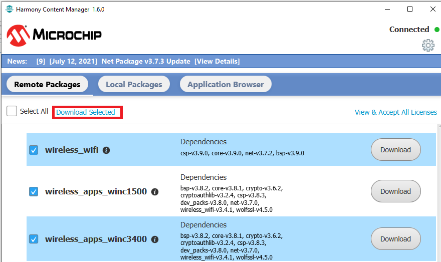

# Create WINC Project - Getting Started

## Download wireless repository from Github

After the installation, open the MPLAB IDE and launch H3 content manager from the IDE

Please provide the framework path with the local system path.

This displays a new window as shown below.

Using this window, user can download either all the packages or only the wireless packages with its required dependencies.

To download the wireless packages and its dependencies:

-   Scroll down and select **wireless\_wifi, wireless\_apps\_winc1500 and wireless\_apps\_winc3400**.

-   Click **Download Selected**

It requests permission to download its dependencies. Click **OK**

In the License Window

-   Select **Accept All License**

-   Click **Close**

Go to the local system path and check if the following packages are downloaded correctly

## Pin mapping between host and WINC

This section explains how to map pins between WINC1500/WINC3400 device and host to establish connection and exchange data. Totally 7/11 pins are involved in pin mapping \(except VCC and GND\) and they are.

-   SPI \(SS, CLOCK, MOSI and MISO\)

-   Reset

-   Chip Enable

-   Interrupt

-   UART only applicable for WINC3400 BLE \(Tx, Rx, CTS and RTS\)

SAME54 and SAMD21 is used as example host throughout this document for both WINC1500 and WINC3400. SAME54 / SAMD21 XPRO board is used as the host development board and WINC1500 XPRO / WINC3400 XPRO is used as development board. Host and the WINC device are connected through extension headers. In this document, Extension 1 of SAME54 / SAMD21 host is used to connect with WINC device.

The one to one pin mapping can be performed between SAME54 / SAMD21 XPRO extension header and WINC XPRO extension header by referring the following sections of the document. Table 4-1 section under 4.1.1 of **[WINC1500 Xplained Pro User's Guide](http://ww1.microchip.com/downloads/en/DeviceDoc/50002616A.pdf)**. Table 4-1 section under 4.1.1 of **[WINC3400 Xplained Pro User's Guide](http://ww1.microchip.com/downloads/en/DeviceDoc/50002702A.pdf)** Table 5-1 section under 5.2.1 of **[SAM E54 Xplained Pro User's Guide](http://ww1.microchip.com/downloads/en/DeviceDoc/70005321A.pdf)** Table 4-1 section under 4.1.1 of **[SAM D21 Xplained Pro User's Guide](http://ww1.microchip.com/downloads/en/devicedoc/atmel-42220-samd21-xplained-pro_user-guide.pdf)** In the same way if the user is using a different host, then he can perform one to one pin mapping by referring that host’s user guide.

### SPI interface

Communication between SAME54 / SAMD21 and WINC happens through SPI interface. Here, WINC acts as a slave and SAME54 / SAMD21 acts as master. The below table lists the SPI pins of WINC extension and its corresponding pins of SAME54 and SAMD21.

### Power up pins

Reset and Chip Enable pins are used to perform power up sequence in WINC from host. The below table lists the power up pins of WINC extension and its corresponding pins of SAME54 / SAMD21.

#### WINC1500 Power up pins

#### WINC3400 Power up pins

#### Interrupt pin

Interrupt pin is used to send signal to host from WINC device.

