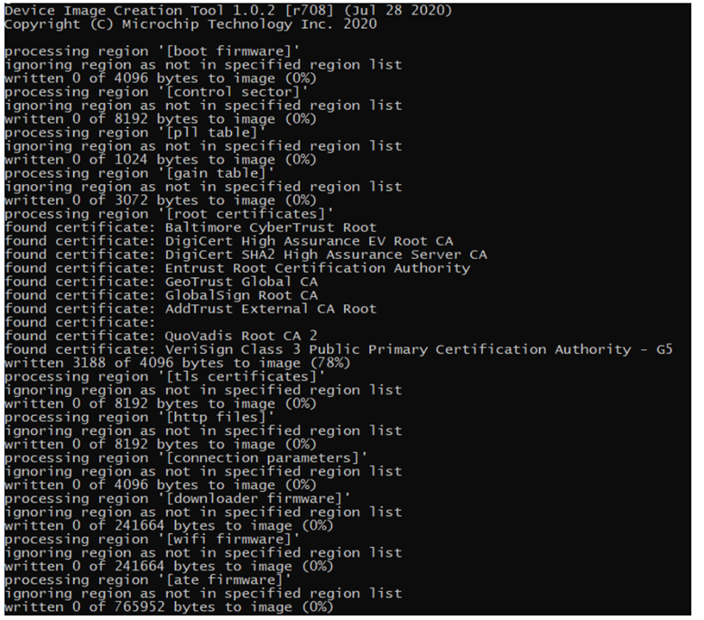
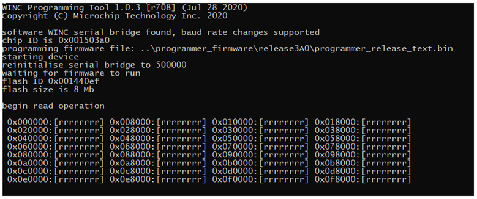

# WINC Devices – Integrated Serial Flash Memory Download Procedure

ATWINC1500/ATWINC3400 features an on-chip microcontroller and integrated SPI Flash memory for
system firmware. The serial flash memory also stores the root certificate required for TLS/SSL connection
and the gain table values used by transceiver. This application note explains in detail downloading
procedure of firmware, certificate, and gain values into WINC serial flash through different supported serial interfaces like UART/I2C. This document also covers some useful troubleshooting tips for downloading failures.

**Features:** 
* Firmware download procedure
* Root certificate download procedure
* Gain table values download procedure
* Troubleshooting tips
* Common download procedure for WINC1500 and WINC3400

## Introduction

The WINC1500 or WINC3400 firmware update project will be available in the path {local system path}\wireless_wifi\utilities\wifi\winc. The latest firmware update project contains the new firmware images as well as the batch script and Shell script files used to download the firmware into Wi-Fi Network Controller (WINC) through SPI/UART.

## Firmware update project 

The ATWINC1500 and ATWINC3400 WiFi devices require firmware to be loaded into flash memory. The ATWINC1500 and ATWINC3400 devices are preloaded with the firmware, however it would be useful to update the latest firmware to take advantage of fixes and new features.

## Download wireless repository from Github 
Install MPLAB® X Integrated Development Environment (IDE). 
After the installation, open the MPLAB IDE and launch H3 content manager from the IDE

Please provide the framework path with the local system path.

This displays a new window as shown below.

Using this window, user can download either all the packages or only the wireless packages with its required dependencies.

To download the wireless packages and its dependencies: 
* Scroll down and select **wireless_wifi, wireless_apps_winc1500 and wireless_apps_winc3400**.
* Click **Download Selected**

It requests permission to download its dependencies. Click **OK**

In the License Window 
* Select **Accept All License**
* Click **Close**

Go to the local system path and check if the following packages are downloaded correctly

The firmware upgrade tool for WINC devices will be available in :  {local system path}\wireless_wifi\utilities\wifi\winc

## Hardware Setup

* SAM D21 Xplained Pro Evaluation Kit (ATSAMD21-XPRO) - SAMD21 is used as a HostMCU
*	ATWINC1500 / WINC3400 Xplained PRO Evaluation Kit (ATWINC1500-XPRO / ATWINC3400-XPRO) - Wi-Fi SPI slave device connected to SAMD21 HostMCU device
*	The ATWINC1500 / ATWINC3400 device is attached to EXT1 of the SAMD21 Xplained Pro kit.
*	Plug a micro-USB cable from Windows computer to the debug USB port of the SAM D21 Xplained Pro Evaluation kit

    

## Serial Bridge Application

As the WINC device is connected to host MCU through SPI interface, upgrading the WINC serial flash via the host MCU would be an easier solution. Since, WINC provides transparent access to host MCU, the WINC serial flash can be read/written from host MCU. The host MCU can program the serial (SPI) flash without the need for operational firmware in the WINC. The host MCU running the serial bridge firmware is connected between computer and WINC SPI to download the firmware to WINC serial flash. 
**winc_programmer_UART (PC) <—-> samd21_xplained_pro_serial_bridge.elf(Host) <—-> WINC SPI device**

### Serial Bridge Application for Harmony 3

* Open MPLAB
* Go to File Menu and select Open Project
* In the next window, select the Serial bridge project from  {local system path}\wireless_wifi\apps\serial_bridge\firmware and click **Open Project**

    

* Build the project
* The click **Make and Program Device** button.

    

### Hardware Setup 

* Power On Sequence 
    * •	To perform a serial flash download using the ATWINC1500 built-in UART, it is mandatory that the ATWINC1500 chip is in the right bootloader state.
    * To do so, the HostMCU must power up the ATWINC1500 chip and then perform the reset sequence as defined in the ATWINC1500 datasheet

* UART Pin Assignment 
    * Pin assignment of WINC1500 module UART are described in the following table.
    * On ATWINC1500 Xplained Pro, TX and RX are available on through holes labeled “DEBUG_UART” for easy identification. 

    | ATWINC1500 module pin name         | ATWINC1500 Xplained Pro pin name       |               Function               |
    | ----------------| ---------------|-------------------------------       |
    | J14    	  | UART_TX| TXD                 |
    | J19     | UART_RXD | RXD |
    |||

    Ensure that the HostMCU is powered up and ATWINC1500 built-in UART is connected to PC via a serial to USB converter.

## General Information on Firmware Update 

The firmware upgrade tool for the WINC devices contains,
* Scripts
* Binary Tools

### Scripts

The "winc" folder in **{local system path}\wireless_wifi\utilities\wifi** path contains the following two scripts.

1. winc_flash_tool.cmd 
    This script is for the firmware upgrade in Windows and it uses the "image_tool" and "winc_programmer_uart/i2c" to build and program the firmware binary image to the WINC devices. 

    * winc_flash_tool.cmd Usage

        |Usage         | Command Example               
        | ----------------|-------------------------------       |
        | To erase the entire flash   | winc_flash_tool.cmd /p COM3 /d WINC3400 /v 1.4.2 /e|
        | To create and program the Firmware Image   |winc_flash_tool.cmd /p COM3 /d WINC3400 /v 1.4.2 /e /x /i prog /w  | 
        | To create and program the All-in-one(AIO) Image   | winc_flash_tool.cmd /p COM3 /d WINC3400 /v 1.4.2 /e /x /i aio /w | 
        | To create OTA Image   | winc_flash_tool.cmd /p COM3 /d WINC3400 /v 1.4.2 /i ota|
        | Writing to "Root certificate" region    | winc_flash_tool.cmd /p COM3 /d WINC3400 /v 1.4.2 /e /x /i root /w| 
        | Writing to "HTTP files" region    | winc_flash_tool.cmd /p COM3 /d WINC3400 /v 1.4.2 /e /x /i http /w| 
        | To read the entire flash   | winc_flash_tool.cmd /p COM3 /d WINC3400 /v 1.4.2 /r| 
        |||

        |Arguments         | Details              
        | ----------------|-------------------------------       |
        | /p   | Serial port for UART mode|
        | /d   |WINC device type   | 
        | /s   | Aardvark serial number | 
        | /v   | Firmware version number|
        | /e   | Erase entire device before programming| 
        | /x    | Read XO offset before creating programming image| 
        | /i   | Image type: prog    - Programmer format aio     - All in one image, raw binary  ota     - OTA root    - Root certificates in programmer format  http    - HTTP files in programmer formatn |
        | /w   | Write to device|
        | /f   | Filename of image file to create|
        | /r   | Read entire flash from device|
        |||

2. winc_flash_tool.sh 
    This script is for the firmware upgrade in Linux and it uses the "image_tool" and "winc_programmer_uart/i2c" to build and program the firmware binary image to the WINC devices. 

    * winc_flash_tool.sh Usage

        |Usage         | Command Example               
        | ----------------|-------------------------------       |
        | To erase the entire flash   | winc_flash_tool.cmd -p TTYS0 -d WINC3400 -v 1.4.2 -e|
        | To create and program the Firmware Image   |winc_flash_tool.cmd -p TTYS0 -d WINC3400 -v 1.4.2 -e -x -i prog -w  | 
        | To create and program the All-in-one(AIO) Image   | winc_flash_tool.cmd -p TTYS0 -d WINC3400 -v 1.4.2 -e -x i aio -w | 
        | To create OTA Image   | winc_flash_tool.cmd -p TTYS0 -d WINC3400 -v 1.4.2 -i ota|
        | Writing to "Root certificate" region    | winc_flash_tool.cmd -p TTYS0 -d WINC3400 -v 1.4.2 -e -x -i root -w| 
        | Writing to "HTTP files" region    | winc_flash_tool.cmd -p TTYS0 -d WINC3400 -v 1.4.2 -e -x -i http -w| 
        | To read the entire flash   | winc_flash_tool.cmd -p TTYS0 -d WINC3400 -v 1.4.2 -r| 
        |||

        |Arguments         | Details              
        | ----------------|-------------------------------       |
        | -p   | Serial port for UART mode|
        | -d   |WINC device type   | 
        | -s   | Aardvark serial number | 
        | -v   | Firmware version number|
        | -e   | Erase entire device before programming| 
        | -x    | Read XO offset before creating programming image| 
        | -i   | Image type: prog    - Programmer format aio     - All in one image, raw binary  ota     - OTA root    - Root certificates in programmer format  http    - HTTP files in programmer formatn |
        | -w   | Write to device|
        | -f   | Filename of image file to create|
        | -r   | Read entire flash from device|
        |||

### ATWINC1500/ATWINC3400 Binary Tools 

The script files internally use the following tools to build and program the image.
1.	image_tool - Builds firmware binary image
2.	winc_programmer_uart/i2c – Program the built firmware binary image to the WINC device using UART or I2C interface.

#### Building Firmware Image 
*  image_tool located in **{local system path}\wireless_wifi\utilities\wifi\winc\tools** is used to build binary images for ATWINC devices.
*  It collects all the binaries for each section and combine it in to one firmware called wincXXXX_X.X.X.bin.
*  The image_tool arrange the section according to the flash memory orgianization of ATWINC1500/ATWINC3400 
*  The image_tool collects the information from the flash_image XML file.
*  Refer flash_image.config XML for how the flash memory is divided.
*  User needs to update the flash_image.config for updating the root certificate or adding custom provisioning pages
* The configuration XML file(flash_image.config) can be found under **{local system path}wireless_wifi\utilities\wifi\winc\files\wincXXXX\X.X.X** directory

#### image_tool Usage 

|Usage         | Command Example               
| ----------------|-------------------------------       |
| To create firmware image   | image_tool.exe -c 1.4.2\flash_image.config -c gain_tables\gain.config -o winc3400_1.4.2.bin -of prog|
| Writing to a specific region(eg: Root certificate)  |image_tool.exe -c 1.4.2\flash_image.config -c gain_tables\gain.config winc3400_1.4.2.bin -of prog -r “root certificates" | 
| To create OTA firmware image   | image_tool.exe -c 1.4.2\flash_image.config -o winc3400_1.4.2.bin -of winc_ota -s ota | 
| To create OTA Image   | winc_flash_tool.cmd -p TTYS0 -d WINC3400 -v 1.4.2 -i ota| 
|||

|Arguments         | Details              
| ----------------|-------------------------------       |
| -c   | Configuration files Microchip recommends to use the default configuration files which is flash_image.config|
| -o  |Output name of the binary image files ATWINC1500: winc1500_X.X.X.bin   ATWINC3400: winc3400_X.X.X.bin|
| -of  | The image_tool supports 4 output formats  raw - Raw binary image.  winc_ota - WINC OTA format. prog - Format suitable for programming. log - Textual log information| 
| -r   | Firmware version number|
| -e   | Erase entire device before programming| 
| -x    | Read XO offset before creating programming image| 
| -i   | Image type: prog    - Programmer format aio     - All in one image, raw binary  ota     - OTA root    - Root certificates in programmer format  http    - HTTP files in programmer formatn |
| -w   | Specifies a region to process.More than one region can be specified with repeated use of this option. If used only the regions specified will be processed.|
|||

For more information, enter image_tool help command:image_tool -h

#### Commands Logs

* Creating Firmware Image 

Expected output log for the command:  
image_tool.exe -c 1.4.2\flash_image.config -c gain_tables\gain.config -o winc3400_1.4.2.bin -of prog

* Writing to a Specific Region 

Expected output log for the command: 

image_tool.exe -c 1.4.2\flash_image.config -c gain_tables\gain.config winc3400_1.4.2.bin -of prog -r “root certificates"

* Creating OTA Firmware Image 

Expected output log for the command:

image_tool.exe -c 1.4.2\flash_image.config -o winc3400_1.4.2.bin -of winc_ota -s ota

#### Programming Firmware Image 

winc_programmer_uart/i2c tool located in src/firmware/firmware is used to program the binary images for ATWINC1500/ATWINC3400 devices using UART or I2C interface. it does the following primary jobs:
* Erase the ATWINC1500/ATWINC3400 memory
* Read the firmware from ATWINC1500/ATWINC3400
* Write the firmware to ATWINC1500/ATWINC3400
* Verify the written firmware.

#### winc_programmer_uart Tool Usage

|Usage         | Command Example               
| ----------------|-------------------------------       |
| Erase ATWINC1500/ATWINC3400 flash memory   | winc_programmer_uart.exe -p COM16 -d winc3400 -e -pfw 1.4.2\firmware\programmer_firmware.bin|
| Write the created binary image to ATWINC1500/ATWINC3400 flash memory  |winc_programmer_uart.exe -p COM16 -d winc3400 -i winc3400_1.4.2.bin -if prog -w -pfw 1.4.2\firmware\programmer_firmware.bin | 
| Verify the written image in ATWINC1500/ATWINC3400 device   | winc_programmer_uart.exe -p COM16 -d winc3400 -i winc3400_1.4.2.bin -if prog -r -pfw 1.4.2\firmware\programmer_firmware.bin | 
| Single command (including all the above operations)   | winc_programmer_UART.exe -p COM16 -d winc3400 -e -i winc3400_1.4.2.bin -if prog -w -r -pfw 1.4.2\firmware\programmer_firmware.bin|
|||

|Arguments         | Details              
| ----------------|-------------------------------       |
| -p   | Port number of the connected HostMCU COM Port Command to find the Port number: test_edbg|
| -d   | ATWINC device: winc1500 or winc3400   | 
| -e   |To erase the ATWINC1500/ATWINC3400 device flash memory before writing the firmware image| 
| -w   | To write the firmware image|
| -r   | To read the firmware image|
| -if    | Input format.  winc_ota - WINC OTA format. raw - A raw binary image. prog - Format suitable for programming.|
| -pfw  | programming firmware :  WINC firmware used to program the device.|
|||

For more information enter winc_programmer_uart help command: 
*winc_programmer_uart.exe -h*

#### Commands logs 

1. Erase WINC memory  

    Expected output log for the command:  
    winc_programmer_uart.exe -p COM16 -d winc3400 -e -pfw 1.4.2\firmware\programmer_firmware.bin

    

2. Write Firmware Image to WINC  
    Expected output log for the command: 

    winc_programmer_uart.exe -p COM16 -d winc3400 -i winc3400_1.4.2.bin -if prog -w -pfw 1.4.2\firmware\programmer_firmware.bin

    

3. Read Firmware Image from WINC memory  
    Expected output log for the Command:  
    
    winc_programmer_uart.exe -p COM16 -d winc3400 -r -pfw 1.4.2\firmware\programmer_firmware.bin

    

4. Verify the Written Image  
    Expected output log for the command:

    winc_programmer_uart.exe -p COM16 -d winc3400 -i winc3400_1.4.2.bin -if prog -r -pfw 1.4.2\firmware\programmer_firmware.bin

    

5. Consolidated Single Command  
    This command does all the all the above operations in a single command.  
    Expected output log for the command:

    winc_programmer_UART.exe -p COM16 -d winc3400 -e -i winc3400_1.4.2.bin -if prog -w -r -pfw 1.4.2\firmware\programmer_firmware.bin

    

### Download Failure Troubleshooting 
Here are the troubleshooting tips for a specific error while downloading using batch script.

1. The script Failed To Find Any COM Port  
The winc_programmer_uart.exe expects a COM port as an argument. If the expected COM port is not found, then it will provide the below error. 

    

    **How to fix it:** 
    * Make sure ATWINC1500/ATWINC3400 COM port is listed in the device manager.
    * Make sure ATWINC1500/ATWINC3400 COM port is not opened by any other application. For verification, try to open and close the COM port with a terminal application.
    * low quality USB cable or low quality serial to USB converter (built-in UART) can introduce garbage on the UART line thus failing the detection of the ATWINC1500/ATWINC3400 COM port. Try a different cable.
    * When performing a “built-in UART download”, it is expected that the ATWINC1500/ATWINC3400 bootloader is in a particular state that can only be achieved after doing a clean power up and reset sequence. Hence, before doing a download always ensure that a clean power up and reset sequence has been made.
    * Make sure that no other extension board (ex: IO1…) is connected to the Xplained Pro board while performing the download.
    * Make sure the project path is not exceeding Windows maximum 260 characters path length.

2. Failed To Initialize Programmer: Invalid Chip ID

    The Failed to initialize programmer with Invalid chip ID error typically happens when there is garbage or noise on the UART line preventing from reading the correct chip ID value. How to fix it:

    * Try connecting the PC and the ATWINC1500/ATWINC3400 with a different cable. A clean power up and reset sequence of the ATWINC1500/ATWINC3400 is necessary to start over with the ATWINC1500/ATWINC3400 bootloader in the appropriate state.

3. Failed To Initialize Programmer: Waiting For Chip Permission

    After printing the correct chip ID of the ATWINC1500/ATWINC3400, the winc_programmer_UART tool programs a small binary (programmer firmware) to assist with ATWINC1500/ATWINC3400 flash programming. At this stage the winc_programmer_UART will change the UART baud rate from 115200 to 500000 to speed up the actual transfer of the firmware image. Once the baud rate change is made, the chip permission is verified to ensure the UART connection is reliable. Failing at this stage means that the current setup does not support such a high baud rate.  
    How to fix it: 
    * It is recommended to try connecting the PC and the ATWINC1500/ATWINC3400 with a different cable. Also a clean power up and reset sequence of the ATWINC1500/ATWINC3400 is necessary to start over with the ATWINC1500/ATWINC3400 bootloader in the appropriate state.

     

