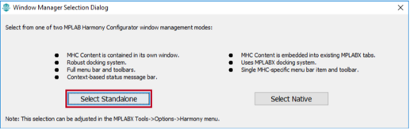
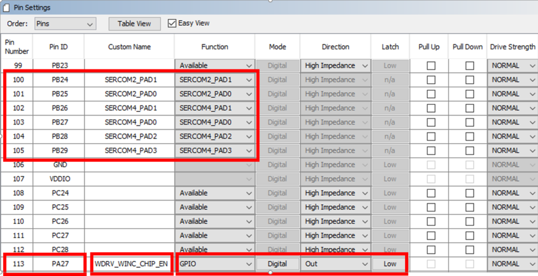
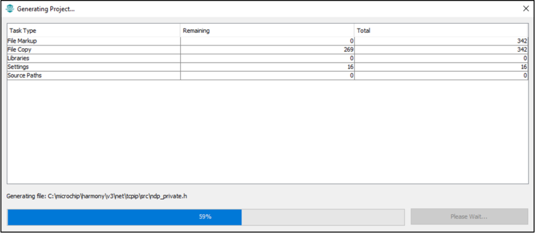
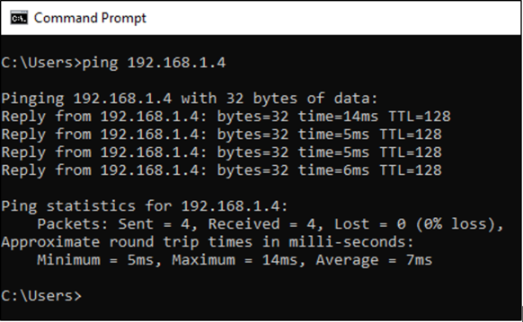

# **Create your first WINC3400 Bypass mode example using Harmony TCP/IP stack**

## **Overview**

This tutorial is a getting-started guide to demonstrate how to create a WINC3400 Bypass \(Ethernet\) mode example using MPLAB® Harmony v3 TCP/IP stack.

This tutorial implements a simple STA Client application on a microcontroller development board. This will guide you through the steps required to create a new TCP/IP application using MPLAB® Harmony 3 modules.

## **Software Details**

This tutorial is tested with following tool versions.

-   [MPLAB® X IDE v5.40](https://www.microchip.com/mplab/mplab-x-ide)

-   [MPLAB® XC32/32++ C Compiler v2.40](https://www.microchip.com/mplab/compilers)

-   [MPLAB® Harmony Configurator Plugin \(MHC\) v3.6.0](https://www.microchip.com/mplab/mplab-harmony)

-   [MPLAB® Harmony v3 Software Framework](https://www.microchip.com/mplab/mplab-harmony)

**Note** : Harmony 3 comes in modular format where user can choose which modules to work with. In order to create WINC1500 bypass mode example, following modules are essential.

Harmony Content Manager tool can be used to download/clone the repositories from Github.

-   bsp v3.9.0

-   core v3.9.2

-   csp v3.9.1

-   dev\_packs v3.9.0

-   mhc v3.8.0

-   net v3.7.2

-   wireless\_wifi v3.5.1

-   wireless\_apps\_winc3400 v3.4.1

## **Hardware Setup**

The getting-started guide demonstrates the creation of a TCP/IP demo on the **SAM E54 Xplained Pro** board with the **ATWINC1500 XPRO board**. These steps can be applied for other supported development boards applying the device/board specific configuration changes. The microcontroller should be supported by NET and Wireless modules within H3. At this point, SAM E54 is the only device supported by both modules. New device support is constantly added to modules. Check the individual module release notes for more details about device support.

-   [SAME54 Xplained PRO](https://www.microchip.com/developmenttools/ProductDetails/ATSAME54-XPRO)

-   [ATWINC3400 XPRO](https://www.microchip.com/DevelopmentTools/ProductDetails/ATWINC3400-XPRO)

The SAME54 Xplained PRO contains a built-in programmer-debugger tool called Embedded Debugger \(EDBG\) which is used in this tutorial.

-   Embedded Debugger \([EDBG](http://ww1.microchip.com/downloads/en/devicedoc/atmel-42096-microcontrollers-embedded-debugger_user-guide.pdf)\).

Following image shows the hardware setup.

## **Creating a new Harmony project**

Follow the steps to create a basic Harmony project. The assumption is that H3 modules are cloned at **"C:\\microchip\\harmony\\v3"**

1.  Open the **MPLAB® X IDE**.

2.  Create a New Project by selecting **File \> New Project**.

3.  In the New Project window select **32-Bit MPLAB® Harmony 3 Project** and click **Next**.

    

    **Note:** The MPLAB® Harmony 3 Project will not be displayed if the MPLAB® Harmony 3 Configurator plug-in is not installed. It has to be installed before continuing with the next steps.

4.  In the **Framework Path**, enter the path of the folder to which the MPLAB® Harmony 3 packages are downloaded.

    

5.  In the Project Setting dialog window, fill in or select the information needed as follows:

    -   **Location**: First, create a "winc\_bypass\_getting\_started" folder in the location of your choice \(for example, create the application project inside the 'C:\\microchip\\harmony\\v3\\wireless\_apps\_winc3400\\apps' folder\). Then enter the path in this field.

    -   **Folder**: Project Folder name. For example, **sam\_e54\_xpro\_winc3400**.

    -   **Name**: Project Name i.e. **winc\_bypass\_getting\_started\_sam\_e54\_xpro\_winc3400**.

    -   **Path**: Selecting the above fields auto populates the **Path**.

        

    -   Click **Next**.

6.  In the Configuration Settings dialog window, fill in or select the information needed as follows:

    -   **Name**: Configuration Name. For example, **sam\_e54\_xpro\_winc3400**.

    -   **Target Device**: Use the below table to chose the target device part number based on the demo board that you are using. For this example: SAM E54 Xplained Pro uses **ATSAME54P20A**.

    -   The **Device Filter** textbox helps narrow down list of available devices as shown.

        

    -   Click **Finish**.

7.  First time when you create a Harmony 3 project, "Window Manager Selection Dialog" appears. The user can select "Standalone" or "Native" depending upon the preference. "Standalone" opens the MHC in a separate window. "Native" opens MHC as a window within MPLAB® X IDE.

    

8.  If the above dialog window doesn't appear then MHC can be launched by selecting MPLAB® Harmony 3 Configurator under **Tools -\> Embedded -\> MPLAB® Harmony 3 Configurator**.

    

9.  In the MPLAB® Harmony Launcher window, leave the launch path as default option i.e. **MPLAB® Harmony Project Path** but make sure it is correctly pointed to desired H3 cloned directory and click **Launch**.

    

10. In the **Configuration Database Setup** window, leave the DFP and CMSIS paths as default and click **Launch**

    

11. MHC window will open now. The default standalone Harmony configurator will be as shown below.

    Different parts of configurator are:

    -   **Available Components**

    -   **Active Components**

    -   **Project Graph**

    -   **Configuration Options**

    -   **Console Window**

    

12. Depending upon the application needs, the necessary components can be added from the **Available Components**.

    Go to **Available Components -\> Board Support Packages \(BSPs\)** and double click on the Board support package for the target board. Below example shows the BSP for SAME54 Xplained Ultra board.

    

    After adding BSP, the Project Graph will look as below:

    

    Basic components needed for creating a project will be available in project graph by default. The next step would be to configure the components based on the application needs.

## **Add TCP/IP Components**

The **TCP/IP** components can be added from the **Available Components**. Go to **Available Components -\> Libraries -\> TCPIP**

The TCP/IP components are categorized into 5 different groups and a configurator is available for each group.

These configurators are:

-   **TCP/IP Application Layer Configurator**

-   **TCP/IP Transport Layer Configurator**

-   **TCP/IP Network Layer Configurator**

-   **TCP/IP Driver Layer Configurator**

-   **TCP/IP Basic Configurator**

**Note:** It is recommended to add the TCP/IP components using these configurators.

When the components are added using configurators, the dependent modules will be auto-activated.

## **Application Layer Configurator**

1.  Under **Available Components**, Select the **TCP/IP Application Layer Configurator** and double click. This step will add the **TCP/IP Application Layer Configurator** inside the **APPLICATION LAYER** group.

    

2.  This step also creates a hierarchy of groups as **Root-\>TCP/IP STACK-\>APPLICATION LAYER**. Verify the hierarchy by going **View:** dropdown and check out different layers.

    

3.  If you changed the view, come back to **APPLICATION LAYER** view by using **View:** dropdown.

4.  Select the **TCP/IP Application Layer Configurator**. See the configurations options on right hand side.

    

    The different application protocols supported in the Harmony TCP/IP stack are listed.

    Start selecting the required TCP/IP application layer protocols from the **Configuration Options** on right hand side.

5.  For the Getting Started demo, select the **DHCP CLIENT**. This step will auto-activate all the dependent components.

6.  Click **Yes** to add the **Harmony Core** component.

    

7.  Click **No** to for the FreeRTOS auto-activation as this demo does not need the FreeRTOS.

    

8.  Click **Yes** to add the **TIME** \(sys\_time\) component.

    

9.  Click **Yes** to add the **CONSOLE** \(sys\_console\) component.

    

10. Click **Yes** to connect the **CONSOLE** component with **TCP/IP CORE**.

    

11. Click **Yes** to add the **DEBUG** \(sys\_debug\) component.

    

12. Click **Yes** to connect the **CONSOLE** component with **TCP/IP CORE**.

    

13. Click **Yes** to add the **IPv4** component in TCP/IP Network Layer.

    

14. Click **Yes** to add the **ARP** component in TCP/IP Network Layer.

    

15. Click **Yes** to add the **UDP** component in TCP/IP Transport Layer.

    

    After the auto-activation of dependent components, the **DHCP CLIENT** component is added to Project Graph

    

16. Add the **DNS CLIENT** to **APPLICATION LAYER**

    

## **Transport Layer Configurator**

1.  Click on **View:** dropdown and go to the **TRANSPORT LAYER**.

    

2.  Select the **TCP/IP Transport Layer Configurator**.

    

    UDP has been auto-activated while adding the Application Layer components.

3.  Add the **TCP** protocol support for this demo.

    

4.  Click **Yes** to add the **TCP** component in the TCP/IP Transport Layer

    

## **Network Layer Configurator**

1.  Click on **View:** dropdown and go to the **NETWORK LAYER**.

    

2.  Select the **TCP/IP Network Layer Configurator**.

    

3.  Add the **ICMPv4** protocol support for this demo.

    

4.  Click **Yes** to add the **ICMPv4** component in the TCP/IP Network Layer

    

5.  Select **ICMPv4** component in project graph to show its configuration settings in Configuration Options window. Enable checkbox for **Use ICMPv4 Client**. We need this to be able to ping other devices.

    

## **Driver Layer Configurator**

1.  Click on **View:** dropdown and go to the **DRIVER LAYER**.

    

2.  Select the **TCP/IP Driver Layer Configurator** and enable **WINC** module checkbox. Click **Yes** to add the **WINC** component in the TCP/IP Driver Layer

    

3.  Click **Yes** to connect the **WINC** component with the **NETCONFIG**.

    

4.  **WINC** component is added in the TCP/IP Driver Layer.

    

## **Basic Configuration**

1.  Click on **View:** dropdown and go to the **Basic Configuration** layer.

    

2.  This layer contains TCP/IP stack's core configuration,interface selection, heap management, MAC configuration, etc. **Basic STACK Configuration** and **Network Configuration** are already auto-activated, during previous steps.

    

3.  Select the **TCP/IP Basic Configurator** and enable **TCPIP CMD**

    

4.  Click **Yes** to connect the **CMD** component with the **SYS Console**.

    

5.  Command module is added to the **Basic Configuration** layer.

    

## **Satisfying Module Dependencies**

The project needs few more Harmony components. In this section, we will add and configure the required components.

1.  Click on **View:** dropdown and go to the **Root** layer.

    

    The **Root** layer will be as shown below. The **red diamond-shaped** buttons are unsatisfied mandatory dependencies. the connections might look messy at first. Feel free to move around some boxes so that project graph looks pretty.

    

-   **Note:** There are two ways to satisfy dependencies. You can either **right-click** on red diamonds and select available satisfiers **OR** you can manually add components from Avilable Components window and **manually** connect diamonds. Both ways are shown here.

### **Satisfy Timer dependency:**

1.  Right click on red diamond for **TIME** module. From the list of Satisfiers, select **TC3**.

    

2.  Timer peripheral instance **TC3** will be added to **Root** layer and connected to the **TIMER** module.

    

### **Satisfy Console dependency:**

1.  From **Available Components \> Peripherals \> SERCOM \>**, double-click on **SERCOM2** to add it to current layer.

    

2.  **SERCOM2** is added to the **Root** layer.

    

3.  To satisy Console UART dependency, **manually connect UART diamond from SERCOM2 with the UART diamond of CONSOLE module**.

    

4.  Select **SERCOM2** in the Project Graph. In the Configuration Options of **SERCOM2**,

    -   Set the **TX Ring Buffer Size** to **1024**

    -   Set the **Receive Pinout** to **PAD**.

    

### **Satisfy TCP/IP Stack's \(i.e. WINC's\) SPI dependency:**

1.  Right click on **DRV\_SPI** red diamond of **TCP/IP STACK** module and select **SPI** as satisfier.

    

2.  Right click on red diamond of SPI driver module and select **SERCOM4**.

    

3.  Select **SERCOM4** in the Project Graph. In the Configuration Options of **SERCOM4**,

    -   Set the **Data IN pad** to **PAD**

    -   Select **Enable SPI Master Hardware Select** checkbox.

    

### **Satisfy Transport Layer LIB\_CRYPTO Dependency:**

1.  Click on **View**: dropdown and go to the **Tranport layer**.

    

2.  Right click on **LIB\_CRYPTO** of **TCP** and select **Cryptographic Library** from **Available Satisfiers**

    

3.  Right click on **LIB\_WOLFCRYPT** of **Cryptographic Library** and select **wolfCrypt Library** from the list of Satisfiers.

    

4.  The project graph will become:

    

### **Satisfy WINC's External Interrupt dependency:**

1.  From **Available Components \> Peripherals \> EIC \>**, double-click on **EIC** to add it to current Root layer.

    

2.  Select **EIC** in the Project Graph. In the Configuration Options of **EIC**,

    -   Select **Enable EIC channel 7**.

    -   Select **Enable Interrupt**

    -   Set the Edge selection to **Falling edge detection**.

    

All necessary dependencies are care of.

## **Project Heap Configuration**

1.  Select the **System** in the Project Graph. In Configuration Options, set the **Heap Size \(bytes\)** to **96960**.

    

## **WINC Driver Configuration**

1.  Click on **View:** dropdown and go to the **DRIVER LAYER**.

    

2.  Select **WINC** module in project graph. In the Configuration Options window, select the Interrupt Source for WINC as recently enabled **EIC Channel 7**.

    

## **Pin Configuration**

The I/O pins on the device can have alternate functions other than the general purpose I/O function. Here, we will configure the functionality of the I/O pins required for this demo.

1.  Open **MHC -\> Tools -\> Pin Configuration**.

    

2.  Configure the pins for **EXT\_INT7, SERCOM2, SERCOM4 and 2 GPIO** as shown below. Notice the GPIO pins must have **Custom Name** as shown in the figure.

    

    

## **Code Generation**

Once Harmony components are added using MHC to the Project Graph, it's time to generate the source files based on the configurations.

1.  Click Save button and Generate the code by clicking the **Generate Code** button \(marked in red\).

    

2.  Select the **Merge Strategy** as **USER ALL**. Refer to the MHC documentation for different merge strategy options.

    

3.  Click the **Generate** button to start the code generation.

    

## **Application Coding**

Now, you have the MPLAB® Harmony components configured for a TCP/IP application. The Getting-Started demo implements a simple Wi-Fi STA application. This application is written using the APIs provided by the MPLAB® Harmony TCP/IP Stack.

There is already a STA demo implemented at **D:\\MH3\\wireless\_apps\_winc3400\\apps\\wifi\_winc\_sta\_bypass**. Let's make use of those source files for the **winc\_bypass\_getting\_started** demo.

1.  Copy the application files \(i.e. **app.c**, **app.h**\) from **D:\\MH3\\wireless\_apps\_winc3400\\apps\\wifi\_winc\_sta\_bypass\\firmware\\src**.

2.  Paste the application files at our current project's location. **D:\\MH3\\wireless\_apps\_winc3400\\apps\\winc\_bypass\_getting\_started\\firmware\\src**.

    

3.  In MPLAB® X IDE project, open the **app.c** file that has been added to project and change the access point parameters as shown in the picture below.

    

## **Build the Application**

1.  Open the project **Properties** by Right Clicking on the project name \(winc\_bypass\_getting\_started\). Ensure that the **XC32** Compiler Tool-chain and **SAME54 EDBG** hardware tool is selected. Press **OK**.

    

2.  Build the application by clicking on the **Build Main Project**.

    

3.  Verify the build results. Make sure that the build is successful.

    

## **Program the Application**

Now, the project is ready to be programmed on the hardware board. Refer to the hardware user-guide to see the different programming options supported.

The SAME54 Xplained board can be programmed using the on-board debugger **EDBG**.

1.  Connect a micro-USB cable from computer to the **DEBUG USB** port on the SAM E54 Xplained Ultra board.

2.  Program the application by clicking on the **Make and Program Device Main Project**.

    

3.  Make sure that the programming is successful.

## **Test the Application**

The testing of the application is done using different console commands.

There will be a virtual COM port enumerated when a micro-USB cable from the computer is connected to the **DEBUG USB** port on SAM E54 Xplained Ultra board.

1.  Open a terminal application \(eg: TeraTerm\) and configure the baud rate for **115200**.

    

2.  Press the **Reset** button on the SAM E54 Xplained Ultra board.

3.  The following messages will be visible on the terminal window.

    

4.  Type **ping <PC's IP address\>** in the terminal window and press **Enter** to see responses.

    

5.  You can also ping this board from your PC using cmd prompt as shown below.

    

6.  Currently, WINC driver is configured not to display any logs. You can change this setting in MHC by going to **DRIVER LAYER** and modifying the WINC configuration as shown below.

    

7.  After re-generating and re-programming with logging turned on, you will see following output in tera term console.

    

You have successfully created and tested your first WINC3400 Bypass mode Application.

## **References**

1.  [TCP/IP Stack Library Help](https://microchip-mplab-harmony.github.io/net/frames.html)

