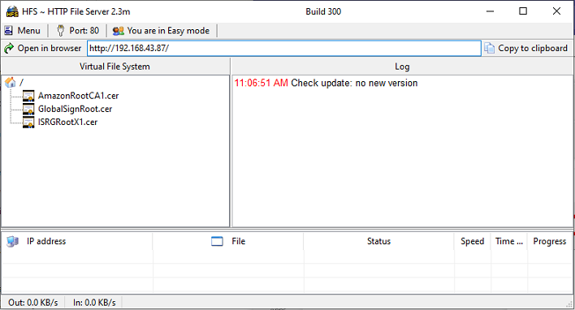
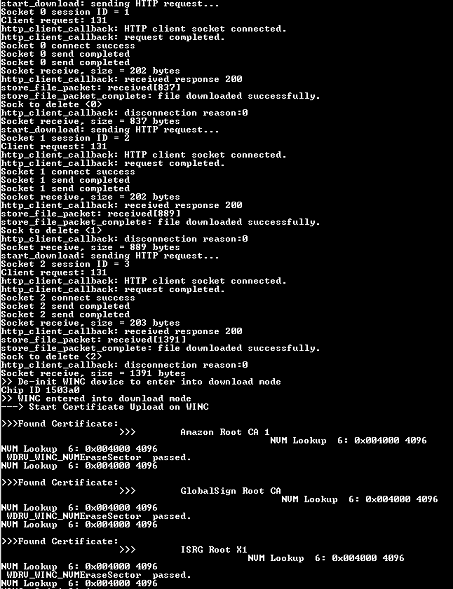

# Certificate Download OTA Demo

This example demonstrates how to download the Root/TLS certificates into WINC3400 via OTA. It downloads the certificates from an OTA download server, which is a web server.

**Note:**

This example will be only available with SAME54 Host.

1.  Use any HTTP server or hfs.exe from http://www.rejetto.com/hfs/

2.  Run the hfs.exe

3.  Add the certificates from the “\\utilities\\cert\_store” to the root folder in the hfs.exe tool.

    

4.  Configure the wifi parameters using "wifi set" command.

    

5.  Copy the URL from server.

    

6.  Enter the command "cert <url\>".

    

7.  Enter the application command "appdemo start 1 19" to run the Certificate download via OTA demo. First the device will connect to the network.

    

8.  After the IP address has displayed on the terminal window, application will execute the CERT command and starts the certificate download.

    


**Parent topic:**[WINC3400 Socket Mode Demo Applications](GUID-0F3F81B8-4EC2-400B-BA38-648D7FD12A61.md)

## Download Root Certificates as a bundle

The existing application can download the Root certificates in der or pem format. If the user wants to convert the certificates into custom WINC format and download it as a bundle, follow the below mentioned steps.

1.  Enable the macro "ROOT\_CERT\_BUNDLE" in "app\_cert\_download\_ota.c"

2.  The root certificate format to be used with winc flash is a winc custom format. User can use the "wireless\_wifi\\utilities\\wifi\\winc\\tools\\image\_tool.exe" to convert the root certificate to required format. User can use the method mentioned in step 3 to convert the certificate into custom WINC format and rename the file as "root\_certs.bin"

3.  Create a single config file to create only the root certificate region as mentioned below.

    ```
         [flash]
    
         size is 1M
    
         default is 0
    
         region at 0x005000 is [root certificates]
    
         [root certificates]
    
         type is root certificates
    
         schema is 2
    
         size is 4K
    
         default is 0xff
    
         file is ../root_certs/AmazonRootCA1.cer
    
         file is ../root_certs/BaltimoreCyberTrustRoot.cer
    
         file is ../root_certs/DigiCert.cer
    
         file is ../root_certs/DigiCertSHA2.cer
    
         file is ../root_certs/EnTrust.cer
    
         file is ../root_certs/GlobalSignRoot.cer
    
         file is ../root_certs/ISRGRootX1.cer
    
         file is ../root_certs/QuoVadis_Root.cer
    
         file is ../root_certs/VeriSign.cer
    ```


Then run the below mentioned command,wireless\_wifi\\utilities\\wifi\\winc\\files\\winc3400\>....\\tools\\image\_tool.exe -c 1.4.4\\root\_certs.config -o root\_certs.bin -of raw

This will create a 1MB binary flash image with the root certificates located at 0x5000 to 0x6000. Then that part of the file can be extracted to have the new root certificate area.

After creating the image, place this "root\_cert.bin" file in the HTTP server and follow the steps 4 to 8 to run the application.

