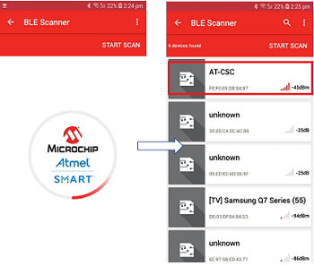

## Custom Serial Chat
This application demonstrates the Custom Serial Chat application used for sending and receiving data between WINC3400 and the Microchip Bluetooth Data mobile application using BLE. The user can send the information to the mobile phone using the console
terminal that is configured with the board and vice versa.

1. Download the Microchip Bluetooth Data application from App Store. 

2. Enter the command "appdemo start 12" to select and run the application.

	

3. Open the Mobile Application and select the "Bluetooth Smart" widget.

	

4. In the Bluetooth Smart Widget, press "START SCAN". From the list of available devices select the device name AT-CSC. 
	
	

5. Enter the pass-key “123456” on Bluetooth Pairing Request window and click Pair.

	

6. After pairing completed, the Custom Serial Chat service appears on the service list page.

7. Click the Custom Serial Chat icon. The chat icon appears, and the user can type the text that is to be sent to the remote device. Press "Send" button.

	

8. The text received from the Mobile application will be displayed on the terminal.

9. The user can write the text on the terminal using the command format "csc send <text_message>" and press ENTER key to send the text.

   
