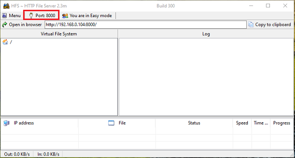
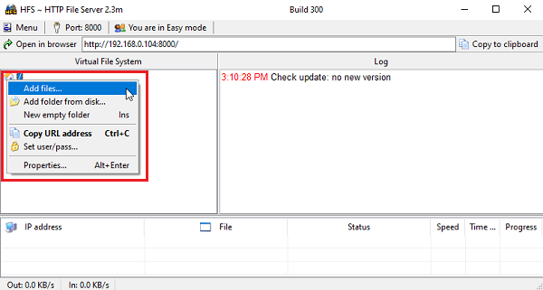
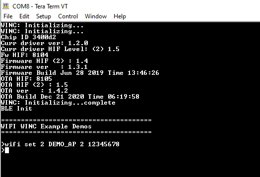
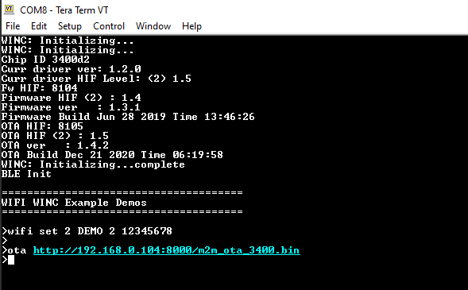

---
grand_parent: Harmony 3 Wireless application examples for WINC3400
parent: Wi-Fi Socket Mode Demos
title:  OTA Demo
has_toc: true
has_children: false
has_toc: false
nav_order: 1

family: SAME54
family: SAMD21
function:  OTA Demo
---	

## OTA Demo
This example demonstrates how to upgrade the WINC3400 firmware via OTA. It downloads the WINC3400 firmware from an OTA download server, which is a web server. 

1. Use any HTTP server or hfs.exe from http://www.rejetto.com/hfs/

2. Run the hfs.exe

3. Set the port number to 8000 in the hfs tool.

	

4. Add the OTA firmware from the “\utilities\m2m_ota_3400.bin” to the root folder in the hfs.exe tool.

		

	**Note**: 
	Current OTA application ( \utilities\m2m_ota_3400.bin ) image is of latest firmware 1.4.2 release, user can select required firmware version of the OTA image as per their choice. To create the required OTA firmware, follow the steps mentioned in the document **Firmware Upgrade of WINC Devices**.

5. Configure the wifi parameters using "wifi set" command.

	

6. Enter the command "ota \<image_url\>". 

	

7. Enter the application command "appdemo start 1 7" to run the OTA demo. First the device will connect to the network. After the IP address has displayed on the terminal window, application will execute the OTA command and starts the OTA firmware upgrade.

	

