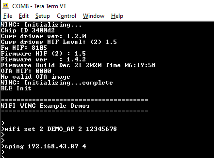
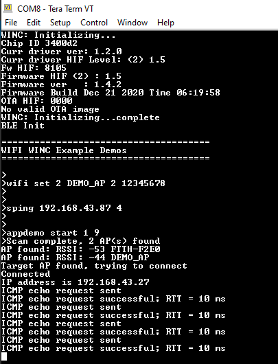

---
grand_parent: Harmony 3 Wireless application examples for WINC3400
parent: Wi-Fi Socket Mode Demos
title:  Ping Demo
has_toc: true
has_children: false
has_toc: false
nav_order: 1

family: SAME54
family: SAMD21
function: Ping Demo
---	

## Ping Demo
This application demonstrates how a user can run a ping test on WINC3400 device in Socket Mode.

1. Configure the wifi parameters using "wifi set" command.

	

2. Enter the command "sping \<ip_address\> \<no_of_ping\>". 

	

3. Then enter the command "appdemo start 1 9" to run the Ping demo.
First the device will connect to the network. After the IP address has displayed on the terminal window, the ping command will start.

	

