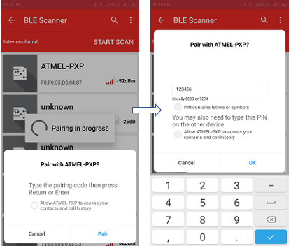

---
grand_parent: Harmony 3 Wireless application examples for WINC3400
parent: Wi-Fi Socket Mode Demos
title:  Proximity Reporter
has_toc: true
has_children: false
has_toc: false
nav_order: 1

family: SAME54
family: SAMD21
function: Proximity Reporter
---	
   
## Proximity Reporter

This application demonstrates the proximity monitoring between the WINC3400 and Android Mobile phone with Microchip Bluetooth Data application. 

**Note:** 
Currently, this demo is disabled in the project **sam_d21_xpro_winc3400.X** due to memory limitation. The user can enable this demo by enabling the macro **APP_BLE_PROXIMITY** in **app.h** file.

1. This is an BLE application example. So the user need to download the Microchip Bluetooth Data application from App Store. 

2. Enter the command "appdemo start 15" to select and run the application.

	

3. Open the Microchip Bluetooth Data application. Select Bluetooth Smart Widget. In the Bluetooth Smart Widget, press "START SCAN". From the list of available devices select the device name ATMEL-PXP.

	

4. Enter the pass-key “123456” on Bluetooth Pairing Request window and click Pair.

	

5. After pairing completed, the supported services are displayed on the application.

	

6. Select the desired service (Link Loss or Immediate Alert) for alert level characteristics configuration. Choose a value from the following: HIGH ALERT/MILD ALERT/NO ALERT

	

7. After configuration of the desired alert levels, click Immediate Alert service and then move the mobile phone away from the Proximity Reporter. Based on the distance of separation, Path Loss is plotted on the zone radar (using RSSI values received from the Proximity Reporter). 

	

8. Based on the zone, the Proximity Monitor sends the corresponding alert level. The console log on the Proximity Reporter displays the corresponding alerts and on-board status LED behavior.

	

9. After configuration of the desired alert levels, click on the Link Loss service and then move the mobile phone away from the reporter. Keep moving until the “Link Loss”pop-up appears. The console log on the Proximity Reporter displays the corresponding alerts and when Link Loss occurs, it reports the disconnection and the on-board status LED behavior. 

	;
	
	
	
10. After Link Loss, the mobile application attempts to reconnect to the Proximity Reporter. The connection is re-established by moving the mobile phone closer to the reporter.

11. Click the Tx Power Service icon in the services screen. The Proximity Monitor reads the Tx Power value from the Proximity Reporter and displays the TX POWER LEVEL.

	
	
	

