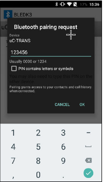

---
grand_parent: Harmony 3 Wireless application examples for WINC3400
parent: Wi-Fi Socket Mode Demos
title:  Transparent Service
has_toc: true
has_children: false
has_toc: false
nav_order: 1

family: SAME54
family: SAMD21
function: Transparent Service
---	

## Transparent Service
 The Transparent Service is used as a data exchange method between the client and the server. This application demonstrates the data exchange using Transparent service.

1. This is an BLE application example. Download and install the Microchip SmartConnect mobile application from "\utilities\apk\BLEDK3_V1.0.apk"

2. Enter the command "appdemo start 16" to select and run the application.

	

3. Open the Open the Microchip SmartConnect mobile application. In application click Scan to start scanning for the BLE devices.

	

4. Select uC-TRANS from the list of scanned devices. 

	
	
5. Enter the pass-key “123456” on Bluetooth Pairing Request window and click Pair.
 
	

6. When paired, the application displays the “Transfer data to device” on the service page. Click Transfer data to device. The chat screen appears where the user can type the text that is to be sent to the remote device, and also see the text coming from the remote device.

	

7. Chat text “Hello” to the remote device. The data/text sent is displayed on the console/terminal for the device connected.

8. The user can write the text on the terminal using the command format "trans send <text_message>" and press ENTER key to send the text.

	
	
	