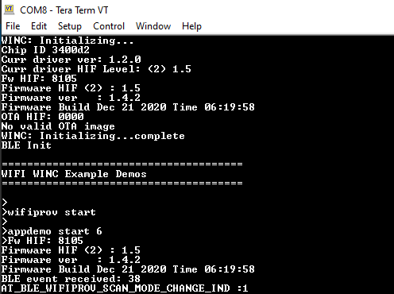
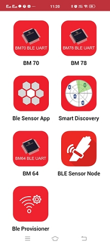
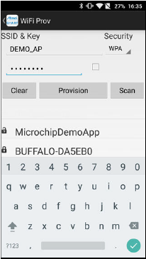

---
grand_parent: Harmony 3 Wireless application examples for WINC3400
parent: Wi-Fi Socket Mode Demos
title:  WiFi Provisioning
has_toc: true
has_children: false
has_toc: false
nav_order: 1

family: SAME54
family: SAMD21
function: WiFi Provisioning
---	

## WiFi Provisioning
The WiFi Provisioning application demonstartes the WiFi provisioning using BLE. 

1. This is an BLE application example. So the user need to download the Microchip Bluetooth Data application from App Store.

2. Enter "wifiprov start" command to start the provisioning.

	

3. Enter the command "appdemo start 6" to select and run the application.

	

4. Open the android application and select the "Ble Provisioner" widget. Then press Scan button.

	

5. Select “WiFi Prov” from the list for the ATWINC3400.

	
	
6. Select the AP and enter the security details and click Provision to start provisioning process.

	
	
7. The mobile application will ask for the password to pair.

8. Enter the pass-key “123456” on Bluetooth Pairing Request window and click Pair.
	
9. The device will connect to the AP and the IP address will be displayed on the terminal.

	
