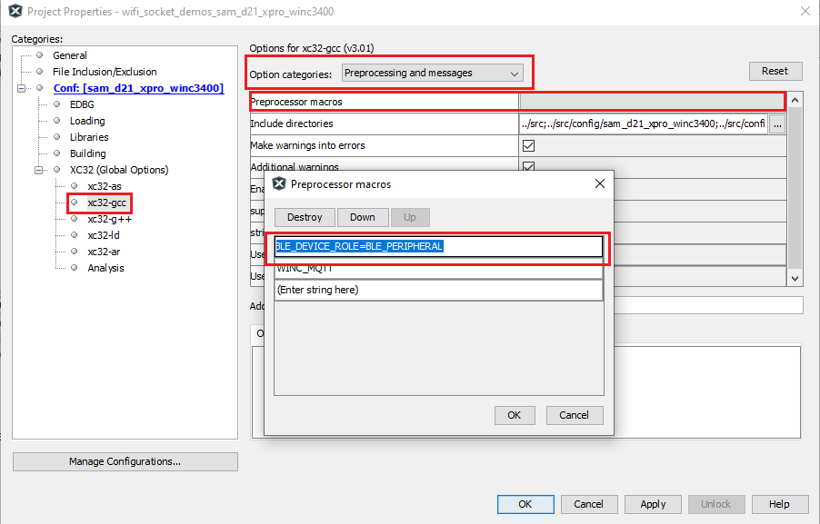

# WINC3400 Example Applications

This example project demonstrates the WINC3400 applications of WiFi and BLE in Socket mode

## Description

This project has both WiFi and BLE example applications. The user can configure the WiFi parameters and select the required example application through command. The user would need to use "Microchip Bluetooth Data" mobile application to run the BLE example applications.
## Downloading and building the application

To download or clone this application from Github, go to the [top level of the repository](https://github.com/Microchip-MPLAB-Harmony/wireless_apps_winc3400)

Path of the application within the repository is ,**wireless_apps_winc3400/apps/wifi_socket_demos/firmware**.

To build the application, refer to the following table and open the project using its IDE.

| Project Name      | Description                                    |
| ----------------| -----------------------------------------------------  |
| sam_e54_xpro_winc3400.X | MPLABX project for SAME54 and WINC3400 Xplained pro|
| sam_d21_xpro_winc3400.X | MPLABX project for SAMD21 and WINC3400 Xplained pro|
| sam_e54_xpro_winc3400_freertos.X | MPLABX project for SAME54 and WINC3400 Xplained pro using FreeRTOS|
|||

## Setting up SAMXXX Xplained Pro board

- Connect the Debug USB port on the SAMXXX Xplained Pro board to the computer using a micro USB cable

## Running the Application

1. Build and program the application project using its respective IDE

2. Open the Terminal application (Ex.:Tera term) on the computer

3. Connect to the "USB to UART" COM port and configure the serial settings as follows:

    * Baud : 115200
    * Data : 8 Bits
    * Parity : None
    * Stop : 1 Bit
    * Flow Control : None

4. Use WiFi commands to configure WiFi parameters and use application commands to select the example application.

WiFi Commands Details

| Command         | Details        |               Example                |
| ----------------| ---------------|-------------------------------       |
| wifi help    	  | Wi-Fi Service help command| wifi help                 |
| wifi set \<bootmode\> \<ssid_name\> \<auth_type\> \<pwd\> \<username/index\>     | Set Wi-Fi Configuration for Station(STA) mode or Access Point (AP) mode | wifi set 2 DEMO_AP 2 12345678 |
| wifi get        | Get Wi-Fi Configuration   | wifi get   |
|||

Wi-Fi command parameters information

| Parameter       | Sub Parameter                                          |
| ----------------| -----------------------------------------------------  |
| bootmode        | 1- Access point(AP) mode. 2- Station(STA) mode.     |
| ssid_name       | SSID name                                			   |
|authtype(Security type) | 1 - OPEN Mode.  2 - WPAPSK mode.  3 - WEP mode.   5 -  802.1x authentication MSCHAPV2 mode.  |
|pwd(password)| Password/passphrase  |
|username/index| Username if authtype is 802.1x authentication MSCHAPV2  or Key Index if the authtype is WEP.  |
|||

Application command parameters information

| Command         | Details        |               Example                |
| ----------------| ---------------|-------------------------------       |
| appdemo help    | Application Service help command| appdemo help        |
| appdemo start \<demo_id\>  | Select and start an application demo | appdemo start 1 |
| appdemo get     | Get the ID of currently running application demo  | appdemo get   |
| appdemo stop     | Stop the currently running application demo  | appdemo stop   |
|||

Application command parameters information

| Parameter       | Sub Parameter                                          |
| ----------------| -----------------------------------------------------  |
| demo_ID         | 1 - WiFi station mode/Access point mode demo. 6 - WiFi Provisioning via BLE.   7 - OTA Demo.   8 - SSL Demo.   9 - Ping Demo.   10 - Iperf demo.   11 - SNTP demo.   12 - Serial Chat.   13 - Heart rate profile.   14 - Battery Service.   15 - Proximity Reporter.   16 - Transparent Service.   18 - MQTT Demo.   19 - Certificate Download OTA Demo.|
|||

## List of Applications

| Application      | Description                                    |
| ----------------| -----------------------------------------------------  |
| [WiFi station mode/Access point mode demo](docs/readme_sta_ap_mode_application.md)  | Demonstartes the Station Mode or Access Point(AP) mode of WINC3400   |  	  
| [WiFi Provisioning via BLE](docs/readme_wifi_prov_via_ble_application.md)  |Demonstartes the WiFi provisioning using BLE |    
| [OTA Demo](docs/readme_ota_application.md) |Demonstartes the OTA firmware upgrade of WINC3400 |        
| [SSL Demo](docs/readme_ssl_application.md)  |Demonstrates TCP SSL Client application |      
| [Ping Demo](docs/readme_ping_application.md) | Demonstrates the Ping test |       
| [Iperf Demo](docs/readme_iperf_application.md) | Demonstrates the iperf application|      
| [SNTP Demo](docs/readme_sntp_application.md)  |Demonstrates how to retrieve time information from the time server|     
| [Custom serial Chat Demo](docs/readme_csc_application.md)   |Demonstrates the Custom Serial Chat application using BLE|    
| [Heart Rate Profile Demo](docs/readme_heartrate_application.md)   | Demonstrates the Heart Rate Profile application using BLE|    
| [Battery Service Demo](docs/readme_battery_service_application.md)   | Demonstrates the Battery Service application using BLE|     
| [Proximity Reporter Demo](docs/readme_pxp_application.md)   | Demonstrates the Proximity Reporter application using BLE|    
| [Transparent Service Demo](docs/readme_transparent_service_application.md) |Demonstrates the Transparent Service application using BLE     |
| [MQTT Demo](docs/readme_mqtt_application.md) | Demonstrates  MQTT Application  |      
| [WiFi Provisioning Demo](docs/readme_wifi_provision_application.md) | Demonstartes the WiFi provisioning application|
| [Certificate Download OTA Demo](docs/readme_certificate_download_ota_application.md) | Demonstartes the Certificate Download OTA Demo|      
|||

### Steps to isolate/copy individual application(s) from the demo
 If the user wants to isolate an application, follow the below mentioned steps  

 For example, the user wants to create an SNTP demo in Socket mode.
1. The SNTP demo uses the WiFi functionalities to get connected with the network. So copy the files "<em> app_wifi.c</em>" and "<em> app_wifi.h </em>" from the path "<em>wireless_apps_winc3400/apps/wifi_bypass_demos/firmware/src </em>" or "<em>wireless_apps_winc3400/apps/wifi_socket_demos/firmware/src</em>" to "src" folder of the new demo project. Then add these files to the project. 

2. Now user should copy and add the SNTP application files "<em>app_sntp.c</em>" and "<em>app_sntp.h</em>" from the path "<em>wireless_apps_winc3400/apps/wifi_bypass_demos/firmware/src </em>" or "<em>wireless_apps_winc3400/apps/wifi_socket_demos/firmware/src</em>" to the "<em>src</em> folder of the new demo project.  

3. The "<em>app.c</em>" and "<em>app.h</em>"  files need to be copied by the user. These files integrate the SNTP application and WiFi functionalities. Copy and add these two files from the same "src" path to the "src" folder of the new demo project.  

4. In "app.c", within "<em>APP_Initialize()</em>" function, initialize the sntp application by calling "<em> APP_SntpInitialize(APPWiFiCallback)</em>".

5. In "app.c" file, make sure that, "<em> APP_WiFiTasks(wdrvHandle)</em>" is getting called from the "<em> APP_STATE_WDRV_OPEN </em>" state of "<em> APP_Tasks() </em>" state machine.

6. In the same state machine "<em> APP_Tasks() </em>", within the state "<em> APP_STATE_WDRV_APP_LOOP </em>" , call the sntp application state machine "<em>APP_SntpTasks(handle)</em>".

7. Now follow the steps mentioned in the SNTP demo document to run the SNTP demo using "wifi", "sntp" and "appdemo" commands.

Similarly, for any application demo, take the required application files along with WiFi files and "app" files to create the demo.

### Steps to isolate/copy individual BLE application(s) from the demo

For BLE applications, no need to copy the WiFi files. But the user should copy the Ble_Service and Ble_Profile files from the path "<em>wireless_apps_winc3400\apps\wifi_socket_demos\firmware\src\ble </em>".

For example, the user wants to create a new project, say "Heart_rate_demo", then

1. Copy and add the ble_manager files from the path "<em>wireless_apps_winc3400\apps\wifi_socket_demos\firmware\src\ble\ble_services\ble_mgr</em>" to the "<em> Heart_rate_demo\firmware\src\ble\ble_services\ble_mgr</em>" of the new project.

2. Copy and add the Heart rate profile files from the path "<em>wireless_apps_winc3400\apps\wifi_socket_demos\firmware\src\ble\ble_profiles\hr_sensor</em>" to the "<em> Heart_rate_demo\firmware\src\ble\ble_profiles\hr_sensor</em>" of the new project.

3. Copy and add the Heart rate service files from the path "<em>wireless_apps_winc3400\apps\wifi_socket_demos\firmware\src\ble\ble_services\heart_rate</em>" to the "<em> Heart_rate_demo\firmware\src\ble\ble_services\heart_rate</em>" of the new project.

4. Now copy and add the application files "app_heart_rate.c" and "app_heart_rate.h" from "<em>wireless_apps_winc3400\apps\wifi_socket_demos\firmware\src</em>" to the "<em> Heart_rate_demo\firmware\src</em>" of the new project.

5. Copy and add the main application files "app.c" and "app.h" files from "<em>wireless_apps_winc3400\apps\wifi_socket_demos\firmware\src</em>" to the "<em> Heart_rate_demo\firmware\src</em>" of the new project.

6. In "app.c", within "<em>APP_Initialize()</em>" function, initialize the Heart Rate application by calling "<em> APP_BleHeartrateInitialize(APPWiFiCallback)</em>".

7. In "app.c" file, make sure that, "<em> APP_BleHeartrateTasks(wdrvHandle)</em>" is getting called from the "<em> APP_STATE_WDRV_OPEN </em>" state of "<em> APP_Tasks() </em>" state machine.

8. Add the macro "BLE_DEVICE_ROLE=BLE_PERIPHERAL" in the project properties.

    

9. Now follow the steps mentioned in the "Heart rate demo document" to run the application using "appdemo" command.

Similarly, for any ble application demo, take the required application files, ble_profile files, ble_service files and "app" files to create the demo.

**Note:**   
1. User has to make sure the project path does not exceed windows path limit.

2. User should reset the device before switching the application and unpair the device from the android phone in case of switching BLE application demos.  

<a href="#top">Back to top</a>