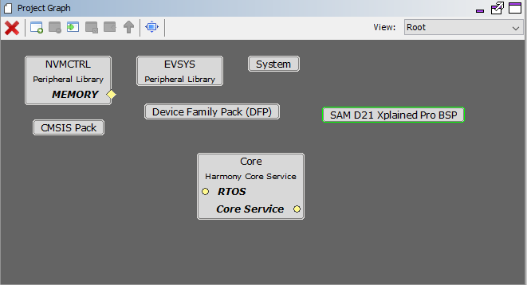
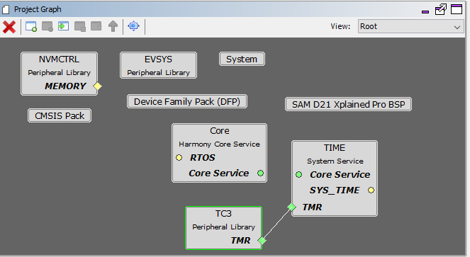
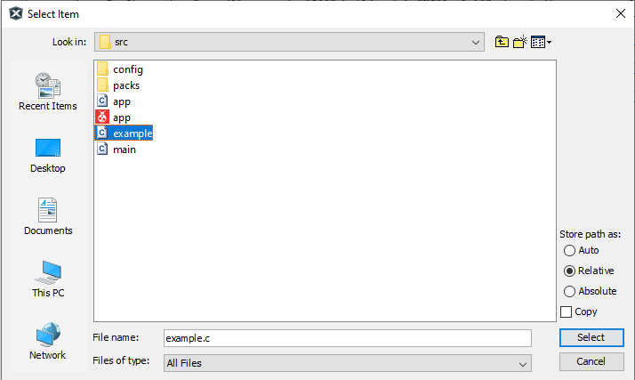
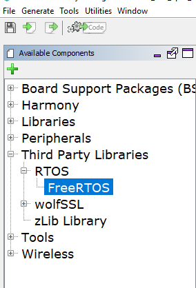

# Example project creation - WINC Socket mode project with SAMD21
This document explains a step by step approach to create a WINC Socket mode project with SAMD21 host.

## Hardware Setup

The document demonstrates the creation of a demo on the SAM D21 Xplained Pro board with the ATWINC1500 XPRO board.

The SAMD21 Xplained PRO contains a built-in programmer-debugger tool called Embedded Debugger (EDBG) which is used in this tutorial.

Following image shows the hardware setup.

## Steps to create the new example project 

Follow the below mwntioned steps to create the new WINC project in socket mode with SAMD21 from scratch.

## Project Creation

* Open MP Lab
* Go to File Menu and select New Project…

    

### Project Selection

* Under the Projects section, select 32bit MPLAB Harmony3 Project and click on Next.

    

### Framework Selection

* Enter the local system path where the packages are downloaded click Next.

    

### Project Settings

* Under {local system H3 path}\wireless_apps_winc1500\apps, create a folder name for the project (Ex: sample_project).
* Enter the full path including the newly created project folder.
* Enter the Folder name and Project name and click on Next (To know about “Folder” and “Name” please click “Show visual Help” button).

    

### Configuration Settings

* Enter a **Name** for the config setting folder
* select the **Target device** name
* Click **Finish**.

    

* Click **Launch** once **Configuration Database Setup** windows pops up.

    

MHC window and has three panes.
1. Available components:  
It lists all the components from downloaded packages.
2. Project Graph. 
It is where the user adds components from Available components
3. Configuration options.  
Each component in project graph can be configured using Configuration options.

    

### Adding components in MH3

User should select required components for creating WINC project.

### Core

The first component to enable is Core because core is the base component for many drivers and system components.

 * Go to Harmony in the Available components
 * Select core.

    

 * Drag and drop it in the **Project Graph**.
 * This will ask permission to activate Free RTOS. Since this project does not require free RTOS, click **No**.

    

 * Core component appears in the Project Graph as shown below.

    

### SAMD21 Xplained pro component

This example uses SAMD21 xplained pro board for host development board.
Enable component SAM D21 Xplained Pro BSP.
* Go to Board Support Packages
* select SAM D21 Xplained Pro BSP

    

* Drag and drop it in the Project Graph.

    

### Timer component

WINC driver needs driver for its delay functionality and user can select the any timer for this.
To enable Timer
* Go to **Harmony -> System Services**
* Select **TIME**

    

* Drag and drop it in the Project Graph.

    

* Right click on **TMR** in the **TIME component**
* Go to Satisfiers and select **TC3** (user can select any timer)

    

* This adds **TC3** connected with **TIME**

    

### EIC component
WINC device uses interrupt pin PB07. To configure PB07, EIC component must be enabled.
* Go to **Peripherals**
* Select **EIC**

    

* Drag and drop it in the Project Graph.

    

Pin PB04 belongs to external interrupt channel 4 so EIC channel 4 has to be enabled and configured.
* Select EIC in the Project Graph
* Please do the following changes in the Configuration Options:
    * Check Enable **EIC channel4** box and expand **EIC channel4 Configuration**
    * Check **Enable Interrupt** box
    * Change **Enable Interrupt4 Edge detection** to **Falling Edge detection**

    

### Virtual Console

Virtual Console is used to send debug messages and to receive commands from user. Virtual console uses UART interface for communication. 
Host SAMD21 uses pins PA22 and PA23 for UART interface to perform receive and transmit operation, respectively. These two pins belong to SERCOM3 of the host SAMD21 device. 
For more information please refer section 5.4.2 (Virtual COM Port) of **[SAM D21 Xplained Pro User's Guide](http://ww1.microchip.com/downloads/en/devicedoc/atmel-42220-samd21-xplained-pro_user-guide.pdf)** 

To enable and configure Virtual COM port:
* Go to **System Services**
* Select **CONSOLE**

    

* Drag and drop it in the Project Graph.

    

UART interface of **SERCOM3** is used by **CONSOLE**.
* Right click on the **UART** port of **Instance 0** of the **CONSOLE** component.
* Go to Satisfiers and select **SERCOM3**.

    

**SERCOM3** appears in **Project Graph** connected with **CONSOLE**. 

**SERCOM3** uses **PAD[1]** for data reception.
* Change the **Receive pinout** property to **SERCOM PAD[1]** in the Configuration Options
* Change the **TX ring buffer size** of **SERCOM3** configuration to "2048"

       

**CONSOLE** has a dependency on **DEBUG** and **COMMAND** component.
To add DEBUG component
* Right click on the SYS_CONSOLE interface of Instance 0 of the **CONSOLE** component.
* Go to **Consumers** and select **DEBUG**

    

* **DEBUG** component connected with **CONSOLE** appears in the Project Graph

    

### To add COMMAND component

* Right click on the SYS_CONSOLE interface of Instance 0 of the CONSOLE component.
* Go to Consumers and select COMMAND

    

* COMMAND component connected with CONSOLE appears in the Project Graph

    

### SPI component

WINC communicates with host using SPI interface. So, to establish a SPI connection between WINC and host, three components are required. 
They are:
* SPI Driver
* SERCOM0 (Peripheral library)
* WINC Driver

To enable SPI driver,
* In the Available Components, go to Harmony -> Drivers.
* Select SPI

    

* Drag and drop it in the Project Graph

    

Connect SERCOM0 with SPI driver.
* Right click on the SPI interface of Instance 0 of the SPI component.
* Go to Satisfiers and select SERCOM0

    

SERCOM0 appears in Project Graph connected with SPI driver.

Enable DMA for SPI driver
* Select instance 0 on SPI driver
* Go to Configurations Options and enable Use DMA for Transmit and Receive

    

* SERCOM0 uses PAD[2] for Data out, PAD[3] for Clock and PAD[1] for Slave select. Change the **SPI Data out Pad** to the required Pad selection in the configuration options of SERCOM0
* Enable the property SPI Master Hardware Slave Select.

    

### WINC Component

Enable WINC Driver in the project:
* In the Available Components, go to Wireless
* Select **Driver -> WINC**

    

* Drag and drop it in the Project Graph.

    

* Connect DRV_SPI interface of SPI interface 0 and WINC component

    

User has the option to select between WINC1500 and WINC3400 using the WINC Device configuration option. 

Enable Interrupt for WINC:
* In the configuration options for WINC, expand Interrupt Source
* Select EIC channel 4

    

**WINC3400 BLE:** 

User can enable BLE option in WINC3400 as shown below.

### MHC PIN Configuration

This section summarizes the pin configuration requirement for MHC pin configuration component.

In MHC, user can do pin configuration with the help of below steps
* Go to Tools in menu bar
* Select Pin Configuration

    

The following window appears

The pin can be configured as shown below.

* RESETN pin configuration:
    For WINC1500,
    * Go to PB06 pin column
    * Change the function to GPIO
    * Name should be changed as “WDRV_WINC_RESETN”

        

    For WINC3400, 
    * Go to PB01 pin column
    * Change the function to GPIO
    * Name should be changed as “WDRV_WINC_RESETN”

        

* Interrupt pin configuration: 
    For both WINC1500 and WINC3400,
    * Go to PB04 pin column
    * Select the function as EIC_EXTINT4

        

* Chip enable pin configuration: 
For both WINC1500 and WINC3400, 
    * Go to PB05 of pin column
    * Change the function to GPIO
    * Name should be changed as “WDRV_WINC_CHIP_EN”

        

* SERCOM0 Pin configuration
    * Go to PA04 pin column
    * Select the function as SERCOM0_PAD0
    * Go to PA05 pin column
    * Select the function as SERCOM0_PAD1
    * Go to PA06 pin column
    * Select the function as SERCOM0_PAD2
    * Go to PA07 pin column
    * Select the function as SERCOM0_PAD3

        

* SERCOM3 Pin configuration
    * Go to PA22 pin column
    * Select the function as SERCOM3_PAD0
    * Go to PA23 pin column
    * Select the function as SERCOM3_PAD1

        

### Save and generate code

To save the modifications
* Click Save Click Generate Code

    

* In the next window, click Generate

    

### Application Code

With above component and pin configuration in MHC, user has required peripheral libraries and drivers for application development. User can follow the API guidelines to develop the application or follow the below step to create simple application for getting started.
* Go to the path {local system path}\wireless_apps_winc1500\apps\{User project name}\firmware\src.
    1. app.c
    2. app.h
    3. example.c
* Replace the following files with the files available in the AP scan example project
{local system path}\wireless_apps_winc1500\apps\ap_scan\firmware\src
* As example.c file does not come with default project, create a new file called example.c under Source Files
* Right click on Source Files
* Select Add Existing Item

    

* Go to {local system path}\wireless_apps_winc1500\apps\{User project name}\firmware\src
* Select example.c

    

* In the file example.c, user can change the Home AP credentials.

    

### Build and program the device

To compile the project
* Right click on the project
* Select Clean and Build

    

After successful build make sure SAME54 XPRO is connected with local system.
* Right click again on the project
* Select Make and Program Device.

    

### Output

Expected output

**Note:** 
If the user wants to create the project using the FrreRTOS, then follow the below mentioned steps.

To add FreeRTOS component
* Select FreeRTOS from Thrid party Libraries -> RTOS -> FreeRTOS

    

* Drag and drop it in the Project Graph

    

* In the configuration options of FreeRTOS, change the **Total heap size** to 10000.

    

