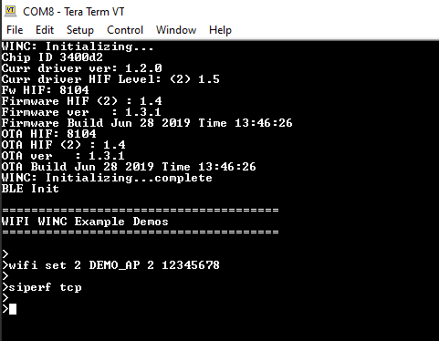

# Iperf Demo

This application demonstrates how a user can run iperf application on WINC3400 device in Socket Mode.

1. Configure the wifi parameters using "wifi set" command.

	

2. Enter "**siperf <tcp/udp>**" on the terminal window to select and start the iperf application demo in the DUT.

	| Command  on DUT       | Details        |
	| ----------------| -----------------------------------------------------  
	| siperf tcp    | Starts the TCP server at the DUT| 
	| siperf udp  | Starts the UDP server at the DUT | 
	|||

	

3. Enter the application command "appdemo start 1 10 " to run the iperf demo. First the device will connect to the network. The IP address will be displayed on the terminal window. Then the TCP/UDP server will get started.

	

4. After the "TCP/UDP" server has started, the user wants to run the iperf commands on the PC to start the iperf application as TCP/UDP Client .

	iperf command details.

	| Command  on PC      | Details        |               Example                |
	| ----------------| ---------------|-------------------------------       |
	| iperf -c \<Server_IP_Address\> -t \<time_peroid\> -i \<time_interval\> -r   | Setup the **TCP Client** in the PC | iperf -c 192.168.43.27 -i 1 -t 10 -r        |
	| iperf -u -c \<Server_IP_Address\> -t \<time_peroid\> -i \<time_interval\> -u -b \<bandwidth\>  -r  | Setup the **UDP Client** in the PC | iperf -u -c 192.168.43.27 -b 20M -i 1 -t 10 -r |
	|||

5. After receiving the "Server Report" on the terminal, enter the iperf commands on the PC to set the iperf application as TCP/UDP server.

	| Command on PC        | Details        |               Example                |
	| ----------------| ---------------|-------------------------------       |
	| iperf -s -i \<time_interval\>   | Setup the **TCP Server** in the PC | iperf -s -i 1        |
	| iperf -s -u -i \<time_interval\>  | Setup the **UDP Server** in the PC | iperf -s -u -i 1 |
	|||
