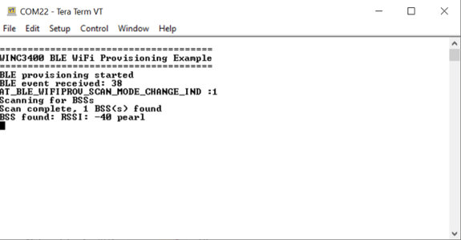
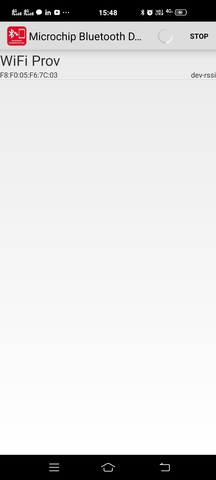

# Wi-Fi provisioning using BLE

This example demonstrates how to pass the AP credentials to WINC3400 device via BLE.

**Parent topic:**[Harmony 3 Wireless application examples for WINC3400](GUID-B02CCF0F-B40C-487D-8D4D-570EFA78D2BF.md)

## Description

This application demonstrates how a user can pass the target AP credentials to WINC3400 device via BLE. The user would need to use "Microchip Bluetooth Data" mobile application to pass the AP credentials to WINC3400 after pairing with the mobile.

## Downloading and building the application

To download or clone this application from Github, go to the [top level of the repository](https://github.com/Microchip-MPLAB-Harmony/wireless_apps_winc3400)

Path of the application within the repository is **apps/wifi\_provision\_via\_ble/firmware** .

To build the application, refer to the following table and open the project using its IDE.

|Project Name|Description|
|------------|-----------|
|sam\_e54\_xpro\_winc3400.X|MPLABX project for SAME54 and WINC3400 Xplained pro|
|sam\_d21\_xpro\_winc3400.X|MPLABX project for SAMD21 and WINC3400 Xplained pro|
| |

## Setting up SAMXXX Xplained Pro board

-   Connect the Debug USB port on the SAMEXXX Xplained Pro board to the computer using a micro USB cable

## Running the Application

1.  Build and program the application project using its respective IDE

2.  Open the Terminal application \(Ex.:Tera term\) on the computer

3.  Connect to the "USB to UART" COM port and configure the serial settings as follows:

    -   Baud : 115200

    -   Data : 8 Bits

    -   Parity : None

    -   Stop : 1 Bit

    -   Flow Control : None

4.  Download the Microchip Bluetooth Data application from App Store and open it.

5.  The WINC3400 device will scan the APs and ready to get paired with Mobile application.

    

6.  In the Mobile Application, Open the "Ble provisioner" widget.

    

7.  In the "Ble provisioner" widget, press the "scan" button. It will list the surrounding BLE devices.

    

8.  The default name given for WINC3400 in the "Wi-Fi provisioning using BLE" application is "Wifi Prov". Click on "Wifi Prov" device.

    

9.  The next screen will display the scanned AP list.

    

10. Select the desired AP from the scan list and provide the required credentials to make Wi-Fi connection.

11. Press "Provision" button

12. The mobile application will ask for the password to pair.

13. The password is stored in the "pincode" variable in the "wifi\_prov.c" file.

14. Enter the password to pair the WINC3400 device with mobile.

    

15. The device will connect to the AP and print the IP address obtained.

    

