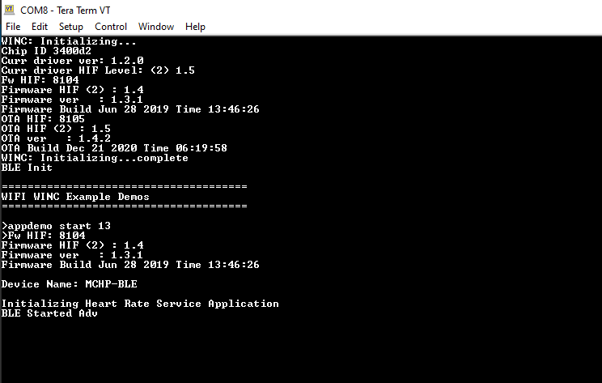
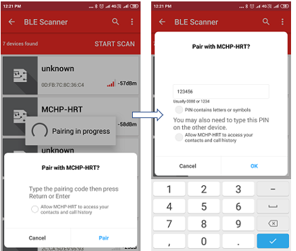

# Heart Rate Profile Application Demo

This application demonstrates the exchange of heart rate parameters of heart rate profile between the sensor and monitor. The heart rate profile is provided by Bluetooth SIG.

1.  This is an BLE application example. So the user need to download the Microchip Bluetooth Data application from App Store.

2.  Enter the command "appdemo start 13" to select and run the application.

    

3.  Open the Microchip Bluetooth Data application. Select Bluetooth Smart Widget. In the Bluetooth Smart Widget, press "START SCAN". From the list of available devices select the device name MCHP-HRT.

    

4.  Enter the pass-key “123456” on Bluetooth Pairing Request window and click Pair.

    

5.  After the device is connected, the application displays the Heart Rate and the Device Information Service. Select Heart Rate Service.

    

6.  When notifications are enabled, the HRM values, Sensor Location and Energy Expended are displayed in the console and the corresponding mobile app.

    

**Parent topic:**[WINC3400 Socket Mode Demo Applications](GUID-0F3F81B8-4EC2-400B-BA38-648D7FD12A61.md)

