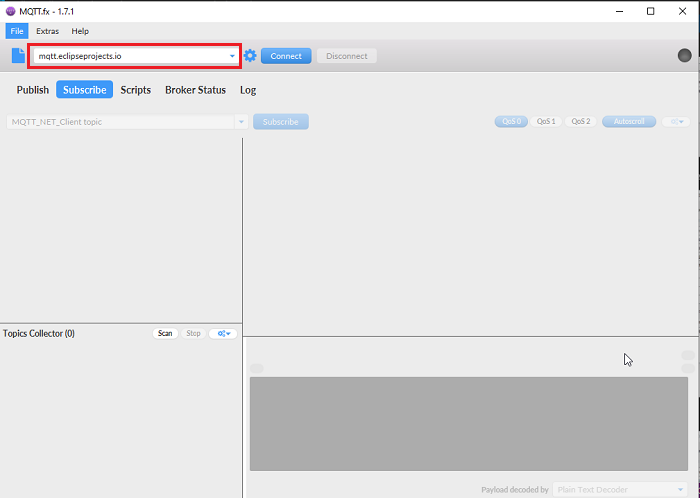
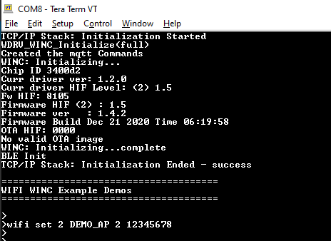
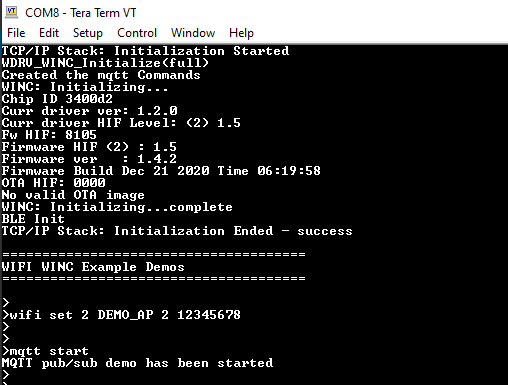
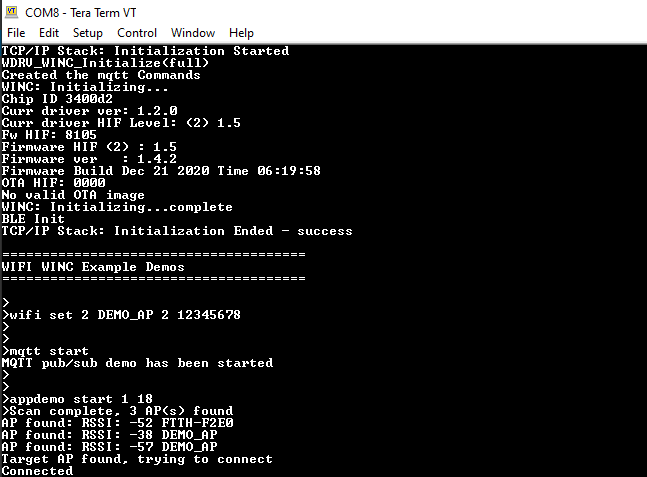
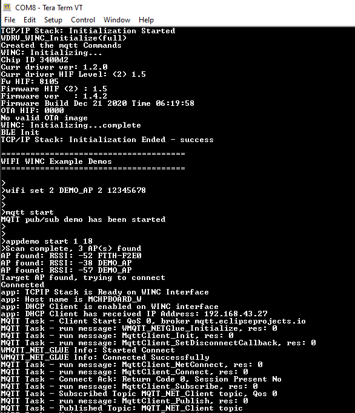
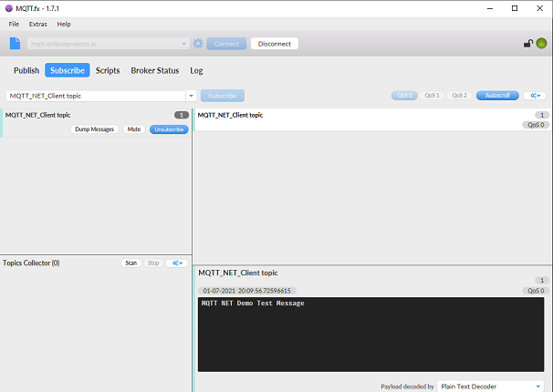
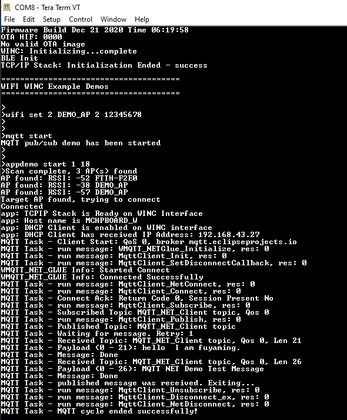

# MQTT Demo

This application demonstrates how a user run a MQTT Client using third party Paho software on WINC3400 device. The user would need to use "MQTT.fx" third party Mqtt Client application to receive message posted by MQTT Client running on WINC3400 device once it connects to the MQTT server.

1. Download the MQTT.fx Third Party Mqtt Client Application and open it on Laptop.

2. Connect the MQTT.fx Application to the MQTT Server - mqtt.eclipseprojects.io with port 1883.

	

3. Make the MQTT.fx Application susbcribe to Topic "MQTT_NET_Client topic".

	

4. Configure the wifi parameters using "wifi set" command.

	

5. Enter the command "mqtt start". 

	

6. Enter the command "appdemo start 1 18". The device will connect to the network and IP address will be displayed on the terminal window.

	

7.  The MQTT Client on the WINC3400 device shall connect to the MQTT Server - mqtt.eclipseprojects.io.

	

8. After connecting to MQTT Server, the MQTT Client on the WINC3400 device shall subscribe to Topic "MQTT_NET_Client topic".

	

9. The MQTT Client on the WINC3400 device shall publish the message "MQTT NET Demo Test Message" to Topic "MQTT_NET_Client topic".

	

10. MQTT.fx Application receives the message "MQTT NET Demo Test Message" on the Topic "MQTT_NET_Client topic" sent by the MQTT Client running on the WINC3400.

	

11. The message "MQTT NET Demo Test Message" will be published from MQTT.fx Application. Since it is subcribing to the same topic "MQTT_NET_Client topic". The MQTT demo will exit after publishing the message.

	

**NOTE:**

Sometimes the MQTT demo will give connection error, if the default broker **mqtt.eclipseprojects.io** is down. If so try the demo with this broker : **broker.hivemq.com** 