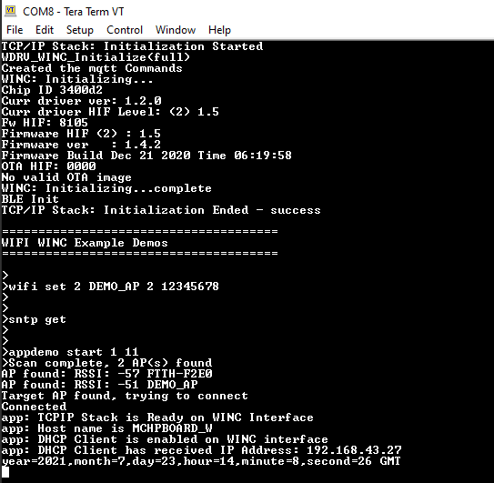

# SNTP Demo

This example demonstrates the use of the WINC3400 to retrieve time information from the time server. Follow the below mentioned steps to run the demo.

1. Configure the wifi parameters using "wifi set" command.

	

2.  Enter the command "sntp get".

	

3. Enter the command "appdemo start 1 11" to run the SNTP demo. First the device will connect to the network. After the IP address has displayed on the terminal window, application will execute the SNTP command and the response will be displayed on the terminal wimdow.

	

