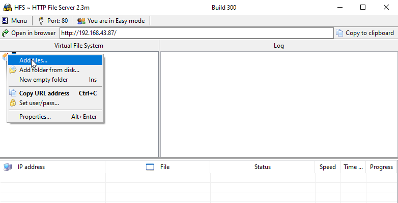
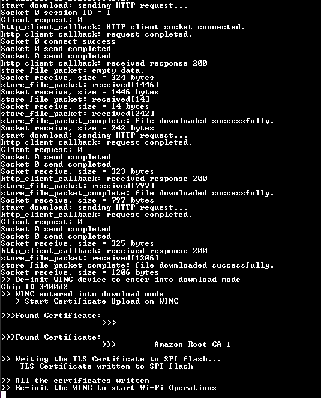

# Certificate Download OTA Demo

This example demonstrates how to download the TLS certificates into WINC3400 via OTA. It downloads the certificates from an OTA download server, which is a web server.

**Note:**

This example will be only available with SAME54 Host.

1.  Use any HTTP server or hfs.exe from http://www.rejetto.com/hfs/

2.  Run the hfs.exe

3.  Add the certificates from the “\\utilities\\cert\_store” to the root folder in the hfs.exe tool.

    

4.  Configure the wifi parameters using "wifi set" command.

    

5.  Copy the URL from server.

    

6.  Enter the command "cert <url\>".

    

7.  Enter the application command "appdemo start 1 19" to run the Certificate download via OTA demo. First the device will connect to the network.

    

8.  After the IP address has displayed on the terminal window, application will execute the CERT command and starts the certificate download.

    

**Parent topic:**[WINC3400 Socket Mode Demo Applications](GUID-0F3F81B8-4EC2-400B-BA38-648D7FD12A61.md)

