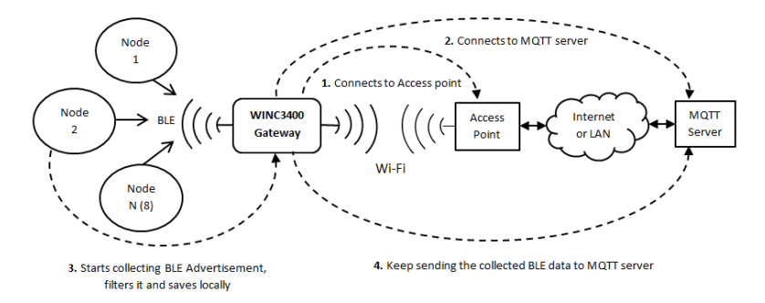
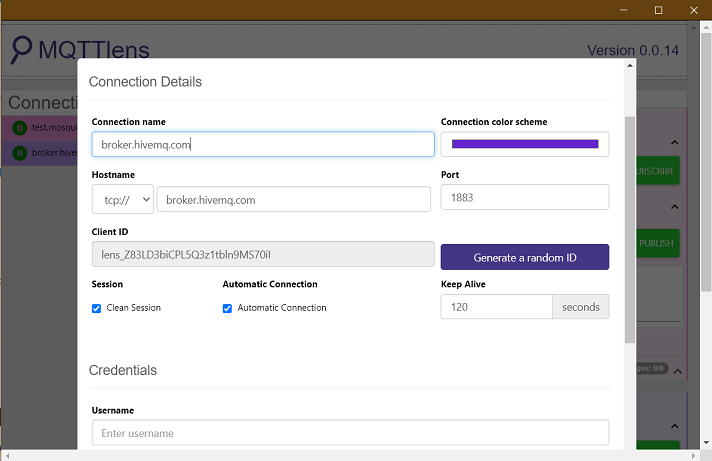
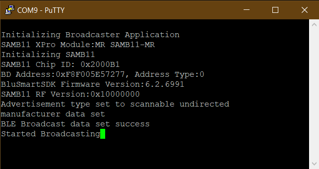
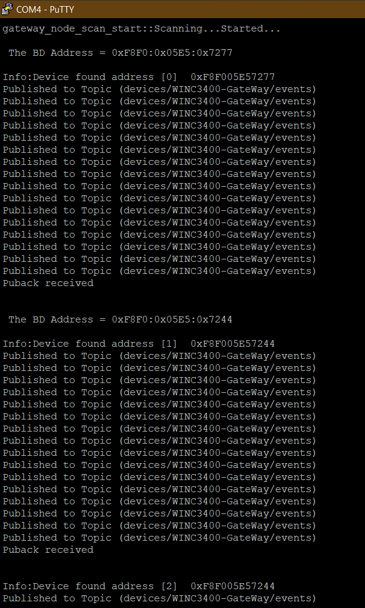
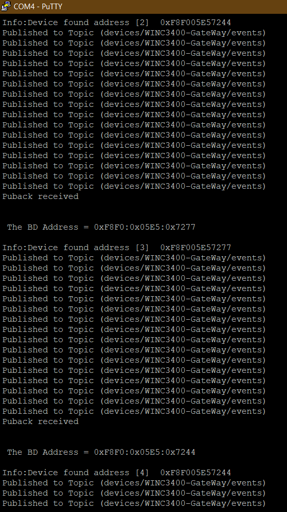
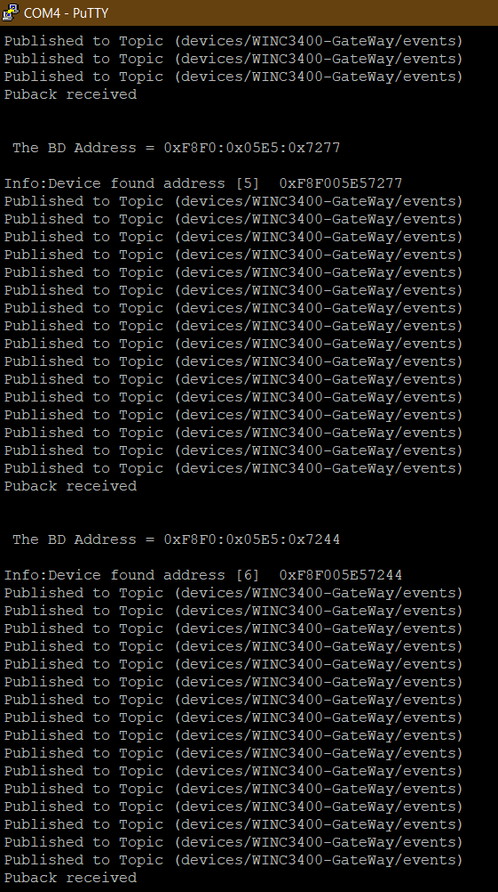

# Wi-Fi BLE Connectionless Gateway Demo

This application implements a gateway/central device that collects data from several BLE nodes and publishes it to the remote MQTT server.

**Note:**

Currently, this demo is disabled in the project **sam_d21_xpro_winc3400.X** due to memory limitation. The user can enable this demo by enabling the macro **APP_PUB_BLE_MQTT** in **app.h** file.

## Description

In this demo, the gateway device does not establish a connection with the BLE nodes. The demo uses ATSAM D21 XPro along with ATWINC3400 XPro board as the gateway device, and BLE nodes can be any BLE device. For this demo ATSAM B11 XPro acts as a BLE node, which sends out BLE advertisement packets. Gateway receives data from the BLE nodes, in the form of advertisement packets using BLE passive scanning mechanism and publishes the data to the remote MQTT server. The messages published by the gateway application can be received (just for the data verification purpose) by [wifi_socket_demos](https://github.com/Microchip-MPLAB-Harmony/wireless_apps_winc1500) application as a MQTT client, by subscribing to the topic used by the gateway, to publish the messages. As an alternate MQTT client, user can [download a Google Chrome Extension - MQTTLens](https://chrome.google.com/webstore/detail/mqttlens/hemojaaeigabkbcookmlgmdigohjobjm?hl=en). 

## Wi-Fi BLE Connectionless Gateway Demo

1. The functional block diagram shows different modules in the Gateway Demo:

	

2. Download the MQTTLens (A Google Chrome Extension) as a MQTT client and open it on laptop

3. Configure the MQTTLens Application for MQTT Server setting - broker.hivemq.com with port 1883 as shown below:

	

4. Subscribe to the Topic "devices/WINC3400-GateWay/events"

	

5. The gateway application mandates that, all the gateway compatible BLE nodes are required to have the advertisement data in a specific format, which the gateway application can parse. The advertisement data should follow the format given below for the gateway application:

	

	The table below provides advertisement packet data with respect to each byte position in the advertisement packet:

	| Bytes | Data Type and Description | Data Value |
	| ---- | ----------- | ------- |
	| 0 | AD Element:- Length (Flags Element Length) | 0x02 |
	| 1 | AD Element:- Type (Flags) | 0x01 |
	| 2 | AD Element:- Value (BR/EDR Supported, LE General Discoverable mode) | 0x06 |
	| 3 | AD Element:- Length (Manufacture Specific Length) | 0x1B |
	| 4 | AD Element:- Type (Manufacture Specific) | 0xFF |
	| 5, 6 | GW Element:- MFG ID (Manufacture ID of Microchip) | 0x00CD |
	| 7 | GW Element:- APP ID (Application ID of WINC3400 Gateway) | 0xAA |
	| 8 | GW Element:- Name LEN (BLE Node Name Length) | XX |
	| 9 - 20 | GW Element:- Name (Maximum length of 12 bytes Node Name) | XX, XX...XX |
	| 21 | GW Element :- Value LEN (BLE Node Value Length) | XX |
	| 22 - 30 | GW Element :- Value (Maximum length of 9 bytes of Node Value) | XX, XX...XX |

    **Note:** It is mandatory to have byte 0 to byte 7 as mentioned in the above table so that gateway can filter other BLE nodes from the gateway compatible BLE nodes.

6. Refer an existing project "SIMPLE_BROADCASTER_SAMB11_XPLAINED_PRO" from Microchip Studio for SAM B11 XPro board - to generate BLE advertisement data for the gateway application. Make the following changes in the "SIMPLE_BROADCASTER_SAMB11_XPLAINED_PRO" project to set-up BLE nodes:

   

   Or, use the **SIMPLE_BROADCASTER_SAMB11_XPLAINED_PRO1.hex file** which is available in "apps\wifi_socket_demos\utilities\hex\SIMPLE_BROADCASTER_SAMB11_XPLAINED_PRO1.hex" with ATSAM B11 XPro board, to set up gateway compatible BLE node as below:

   

   

7. Configure the WiFi parameters using the "wifi set" command. Device will connect to the access point and the assigned IP address will be displayed on the terminal window. Now, enter the command "appdemo start 1 20" to run the Gateway application. The gateway device creates an MQTT connection with the pre-configured MQTT server: broker.hivemq.com 

	

8. Once the MQTT connection is successful, the WINC34000 starts collecting the BLE advertisement data. These data packets are sent to MQTT server in a loop. The gateway application maintains a counter to monitor the node status. The counter keeps incrementing at a regular interval and if overflows and reaches 0, the node is marked as dead. But if the node was alive and transmitting advertisement packets for every received advertisement data the counter is reset to 1 and node becomes alive.

9. The gateway publishes messages on "devices/WINC3400-GateWay/events" topic
   
	

    

    

    

10. Use command "appdemo get" to get the DemoId of the current application, and "appdemo stop" to stop the current (Gateway) application
   
    

* Enable MQTT (*Only if you are using this application individually, you need to enable this macro*)
Follow the steps below to enable the macro "WINC_MQTT" for the gateway application:

	* Open project properties

		

	* Select xc32-gcc

		

	* Select "preprocessing and messages" from the "Option Categories".

		

	* Select the "add" button of "Preprocessor Macros"

		

	* Add the macro "WINC_MQTT" and press OK

		