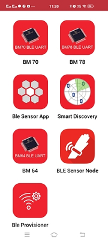

# WiFi Provisioning via BLE

The WiFi Provisioning application demonstartes the WiFi provisioning using BLE. 

1. This is an BLE application example. So the user need to download the Microchip Bluetooth Data application from App Store.

2. Enter "wifiprov start" command to start the provisioning.

	

3. Enter the command "appdemo start 6" to select and run the application.

	

4. Open the android application and select the "Ble Provisioner" widget. Then press Scan button.

	

5. Select “WiFi Prov” from the list for the ATWINC3400.

	
	
6. Select the AP and enter the security details and click Provision to start provisioning process.

	
	
7. The mobile application will ask for the password to pair.

8. Enter the pass-key “123456” on Bluetooth Pairing Request window and click Pair.
	
9. The device will connect to the AP and the IP address will be displayed on the terminal.

	
