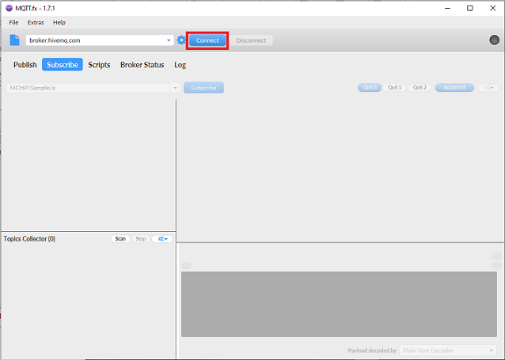
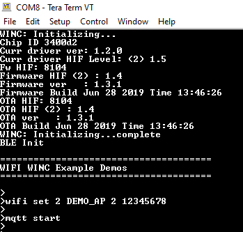
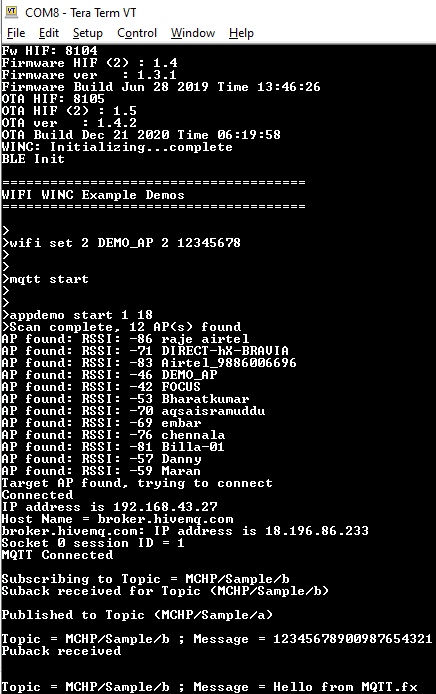
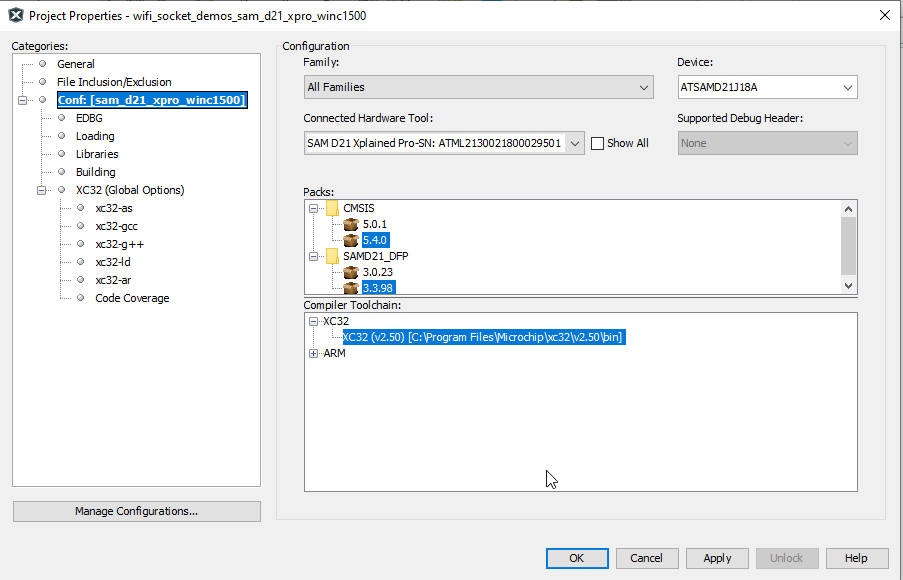
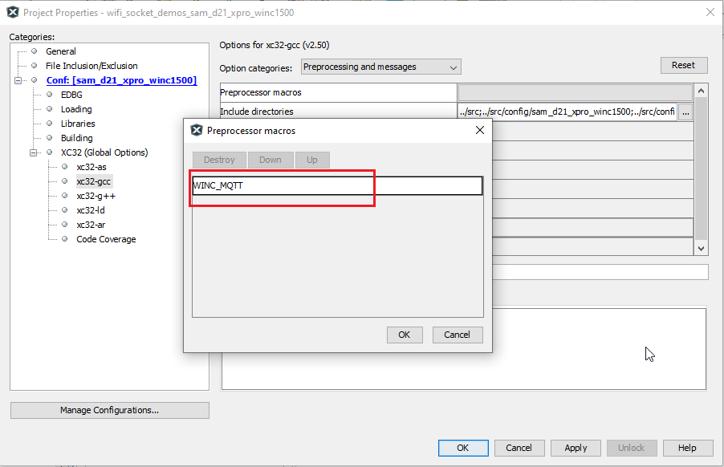

# MQTT Demo

This application demonstrates how a user run a MQTT Client using third party Paho software on WINC3400 device. The user would need to use "MQTT.fx" third party Mqtt Client application to receive message posted by MQTT Client running on WINC3400 device once it connects to the MQTT server.

1. Download the MQTT.fx Third Party Mqtt Client Application and open it on Laptop.

2. Connect the MQTT.fx Application to the MQTT Server - broker.hivemq.com with port 1883.

	

3. Make the MQTT.fx Application susbcribe to Topic MCHP/Sample/a.

	

4. Configure the wifi parameters using "wifi set" command.

	

5. Enter the command "mqtt start". 

	

6. Enter the command "appdemo start 1 18". The device will connect to the network and IP address will be displayed on the terminal window. Then the MQTT Client on the WINC3400 device shall connect to the MQTT Server - broker.hivemq.com.

	

7. After connecting to MQTT Server, the MQTT Client on the WINC3400 device shall subscribe to Topic MCHP/Sample/b.

	

8. The MQTT Client on the WINC3400 device shall publish the message "Hello" to Topic MCHP/Sample/a.

	

9. MQTT.fx Application receives the message "Hello" on the Topic MCHP/Sample/a sent by the MQTT Client running on the WINC3400.

	

10. Publish message from MQTT.fx Application on the Topic MCHP/Sample/b.

	

11. The MQTT Client on the WINC3400 device receives the message on the Topic MCHP/Sample/b sent by the MQTT.fx Application running on the laptop.

	

**Note:**

If the user wants to create a MQTT application project in Socket Mode, and wants to use the Paho for MQTT Protocol, One needs to follow the below mentioned steps

	1. From the "paho.mqtt.embedded-c" repo, copy the folder "paho.mqtt.embedded-c\MQTTPacket" to "app_demos\firmware\src\third_party\paho.mqtt.embedded-c\MQTTPacket" of the new project directory.

	2. From the "paho.mqtt.embedded-c" repo, copy the folder "paho.mqtt.embedded-c\MQTTClient-C" to "app_demos\firmware\src\third_party\paho.mqtt.embedded-c\MQTTClient-C" of the new project directory.
	
	3. It is important to have the porting files "MCHP_winc.c" and "MCHP_winc.h" in the project. These porting files are available only in "wifi_socket_demo" project. Copy the folder from "wifi_socket_demos\firmware\src\third_party\paho.mqtt.embedded-c\MQTTClient-C\Platforms" to "app_demos\firmware\src\third_party\paho.mqtt.embedded-c\MQTTClient-C\Platforms" of the new project directory. Please make sure that the folder structure of the new project is same as mentioned above.

* Enable MQTT
	User should enable the macro "WINC_MQTT" to enable the MQTT application. For this follow the steps:
	* Open project properties

		

	* Select xc32-gcc

		

	* Select "preprocessing and messages" from the "Option Categories".

		

	* Select the "add" button of "Preprocessor Macros"

		

	* Add the macro "WINC_MQTT" and press OK.

		

