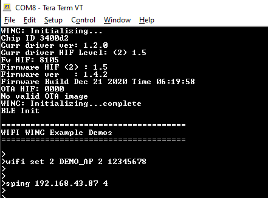

# Ping Demo

This application demonstrates how a user can run a ping test on WINC3400 device in Socket Mode.

1. Configure the wifi parameters using "wifi set" command.

    

2. Enter the command "sping \<ip_address\> \<no_of_ping\>".

    

3. Then enter the command "appdemo start 1 9" to run the Ping demo.
First the device will connect to the network. After the IP address has displayed on the terminal window, the ping command will start.

   
