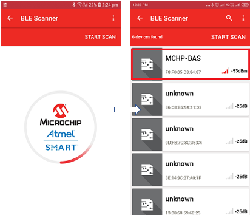
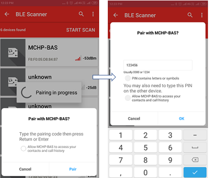
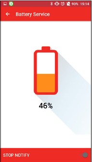

# Battery Service Application Demo

The]is application demonstartes the reporting of battery level of the device using the battery characteristics. This example application simulates the device battery level from 0% to 100%, with the step of 1% every second.

**Note:**

Currently, this demo is disabled in the project **sam_d21_xpro_winc3400.X** due to memory limitation.
The user can enable this demo by enabling the macro **APP_BLE_BATTERY** in **app.h** file.

1. This is an BLE application example. So the user need to download the Microchip Bluetooth Data application from App Store.

2. Enter the command "appdemo start 14" to select and run the application.

	

3. Open the Microchip Bluetooth Data application. Select Bluetooth Smart Widget. In the Bluetooth Smart Widget, press "START SCAN". From the list of available devices select the device name MCHP-BAS.

	

4. Enter the pass-key “123456” on Bluetooth Pairing Request window and click Pair.

	

5. When paired, the application displays the Battery Service and the Generic Information service.

6. Select “Battery Service” to receive notifications for the battery level characteristic.
	
	